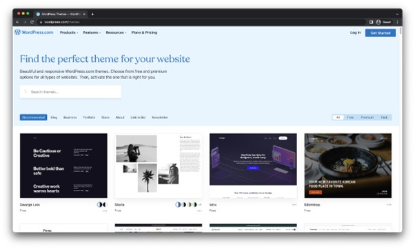
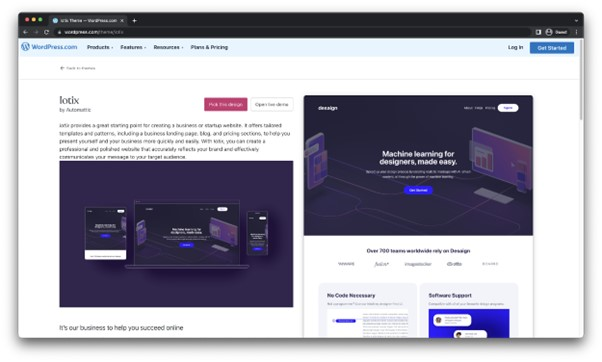

Додатни аспекти веб-дизајна
===========================

Оптимизација за претраживачке машине
_____________________________________

Оптимизација за претраживачке машине (*Search Engine Optimization, SEO*) представља скуп техника и стратегија које се примењују на веб-сајт како би се побољшало његово рангирање на резултатима претраживачких машина, као што је Гугл претраживачка машина. Циљ *SEO* је повећање видљивости и посећености веб-сајта, што може довести до већег броја посетилаца и потенцијалних купаца (у случају комерцијалних веб-сајтова).

Кључни фактори који утичу на *SEO* укључују квалитетан садржај са релевантним кључним речима, одговарајућу употребу метаознака, добро структуриран и оптимизован HTML код, брзину учитавања страница, прилагођеност за преносне уређаје и друге технике.

Добра *SEO* стратегија може помоћи веб-сајту да се истакне међу конкуренцијом, побољшати корисничко искуство и повећати вероватноћу да ће корисници пронаћи и посетити сајт. Уз редовно праћење и ажурирање SEO тактика, веб-сајт може постићи дугорочан успех на интернету.

Готова веб-дизајн решења
________________________

Постоји велики број алата који нуде могућност дизајна и израде веб-сајтова, а од корисника не траже познавање теорије дизајна, програмских језика и технологија потребних за развој веб-сајтова. Корисници бирају један од великог броја шаблона од којих започињу развој веб-сајта, а затим, изменом елемената и њиховог садржаја прилагођавају садржај веб-сајта тако да одговара њиховим потребама. Најпопуларнији сервиси овог типа су: WordPress, Weebly, Wix и др.

    *Слика 2. Каталог шаблона веб-сајтова доступних за платформу WordPress.*

    *Слика 3. Пример шаблона за веб-сајт на платформи WordPress.*

.. learnmorenote:: **За знатижељне:** 

    Посети веб-сајт на адреси *www.wordpress.com/themes* и пронађи дизајн који ти се највише допада. Шта ти је остало најупечатљивије код одабраног дизајна? Какве веб-сајтове мислиш да је прикладно направити одабраним дизајном?