Подешавање XAMPP пакета алата
=============================

У овој лекцији ћеш инсталирати XAMPP, пакет који садржи различите алате за развој веб-апликација. Један од најважнијих алата јесте веб-сервер који можеш да користиш за опслуживање веб-услуга. У овој, али и у наредним темама, овај алат ћеш користити за испоручивање HTML и других садржаја. Поред веб-сервера, неки од алата са којима ћеш се упознати у теми о веб-серверском програмирању су *MySQL*, сервер за управљање релационим базама података, и *phpMyAdmin*, визуелни алат за управљање релационим базама података.

Софтверске пакете неопходне за инсталацију XAMPP алата можеш преузети са адресе *https://www.apachefriends.org/download.html*. Након преузимања, потребно је да покренеш пакет, чиме ћеш добити прозор као са наредне слике. Притисни дугме *Next*.

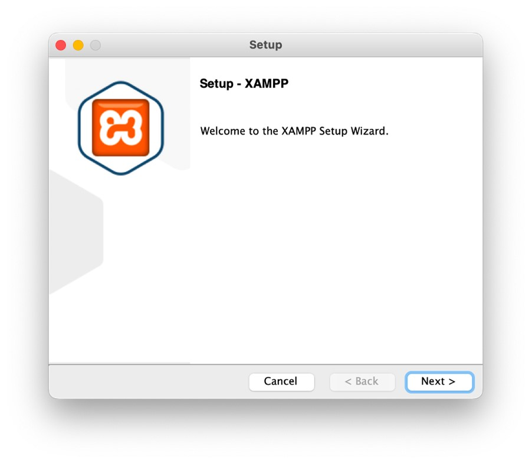

Уколико то већ није урађено, означи опцију *XAMPP Developer Files* и притисни дугме *Next*.

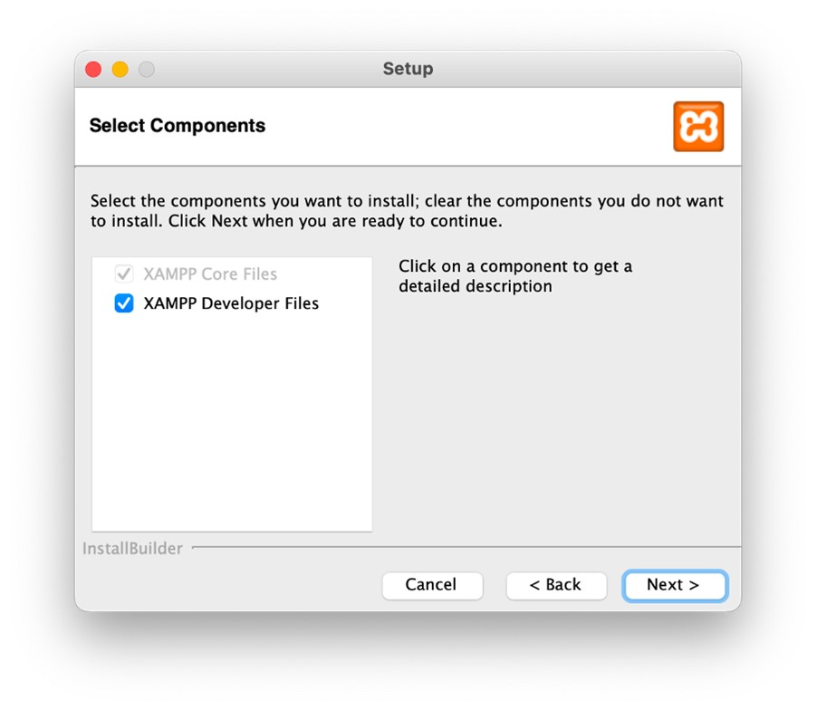

На наредном прозору ће ти бити приказано у ком директоријуму ће XAMPP пакет бити инсталиран. Важно је да запамтиш ову путању пошто ћеш у оквиру тог директоријума чувати своје веб-ресурсе. Притисни дугме *Next*.

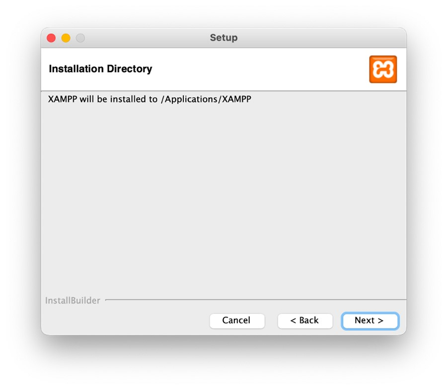

Прозор за инсталирање пакета ће ти рећи да је спреман да започне инсталацију. Притисни дугме *Next*.

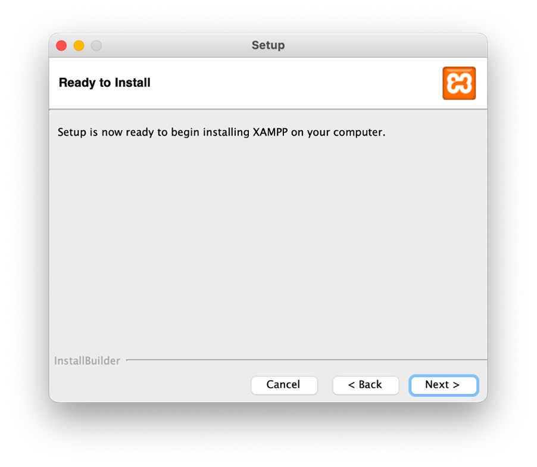

На овом прозору можеш пратити инсталацију. Инсталација може потрајати до неколико минута.

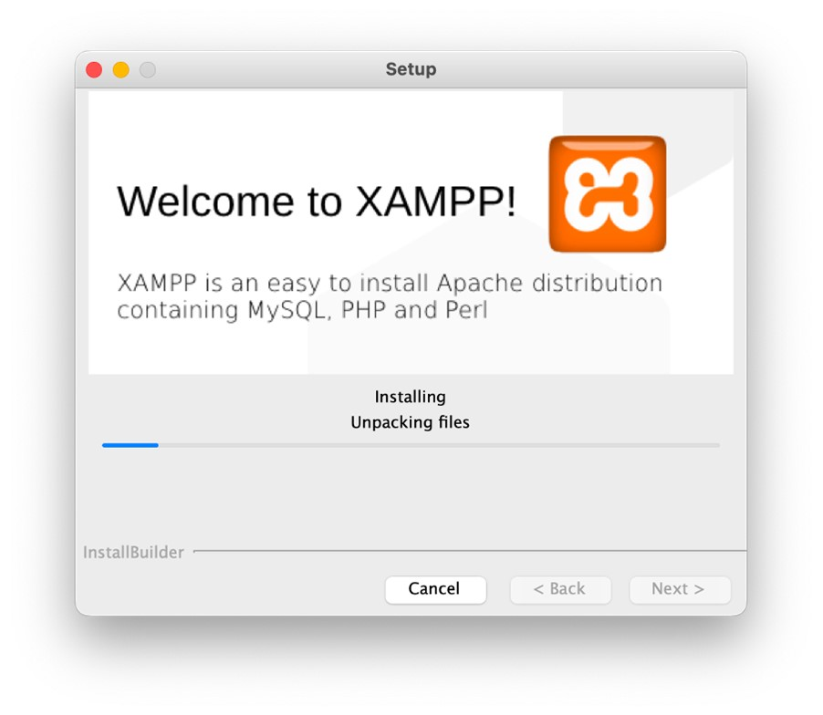

Уколико је све било успешно, добићеш наредни прозор. Означи *Launch XAMPP* ако то већ није урађено и притисни дугме *Finish*.

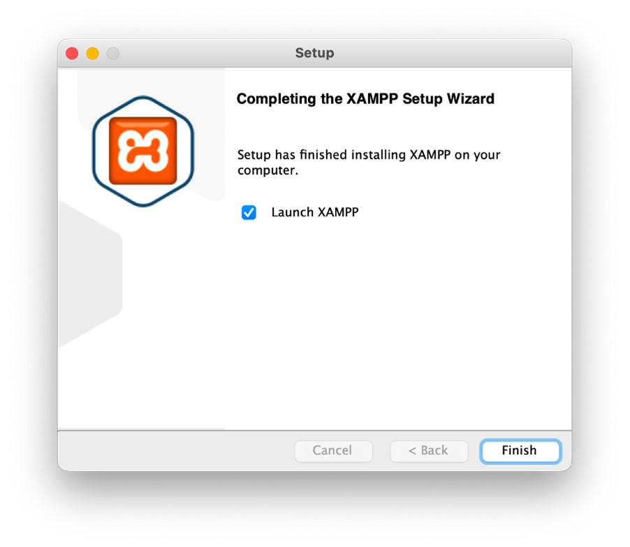

Приликом покретања XAMPP алата, оперативни систем ти може затражити администраторске привилегије. Унеси креденцијале и дозволи покретање апликације. Требало би да ти се отвори наредни прозор.

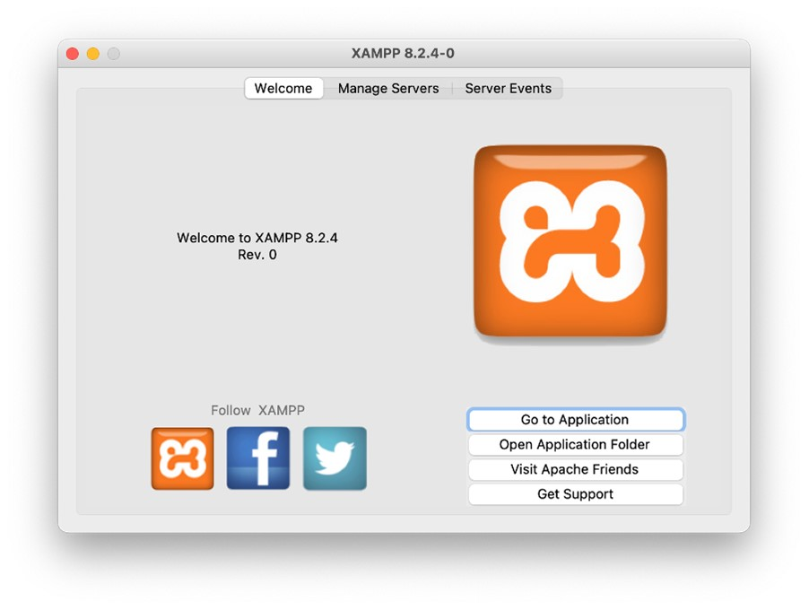

XAMPP алат је потребно да остане покренут како би веб-сервер функционисао. Ако отвориш језичак *Manage Servers*, требало би да поред *Apache Web Server* стоји *Running*, што је ознака да је веб-сервер покренут успешно. У случају да ипак стоји *Stopped*, онда је потребно да означиш веб-сервер и притиснеш дугме *Start*. Након неколико секунди веб-сервер ће бити покренут и одговарајући статус ће бити приказан.

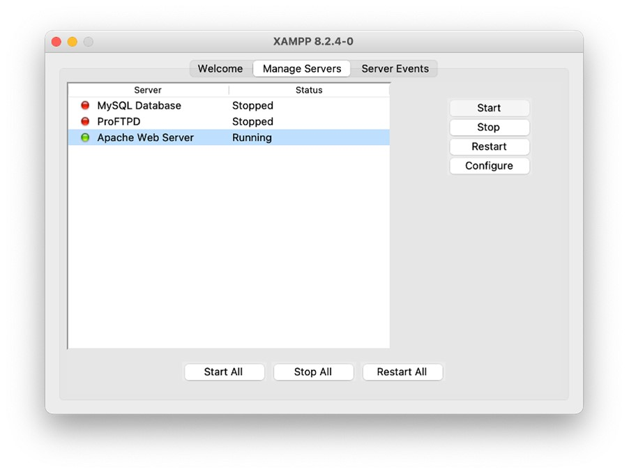

Отвори директоријум који је наведен приликом инсталације. Ту ћеш пронаћи директоријум *htdocs*. Ово је директоријум у којем ћеш чувати своје HTML, CSS, JS и остале датотеке са изворним кодом, као и све веб-ресурсе за које желиш да буду доступни.

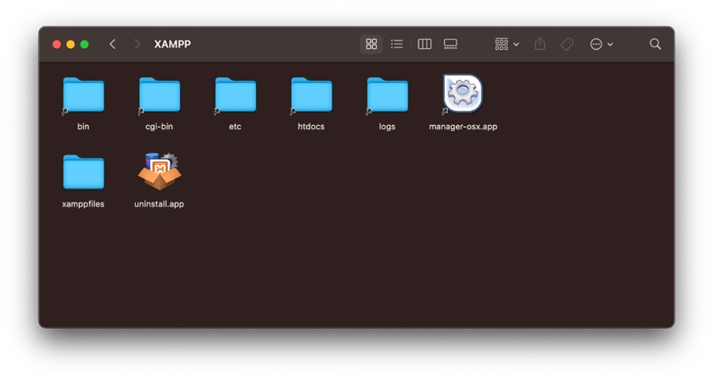

Директоријум *htdocs* подразумевано садржи веб-сајт где можеш пронаћи различите информације о XAMPP инсталацији. Отвори веб-прегледач и унеси адресу *localhost* или *127.0.0.1*. Требало би да добијеш веб-сајт сличан као онај на наредној слици.

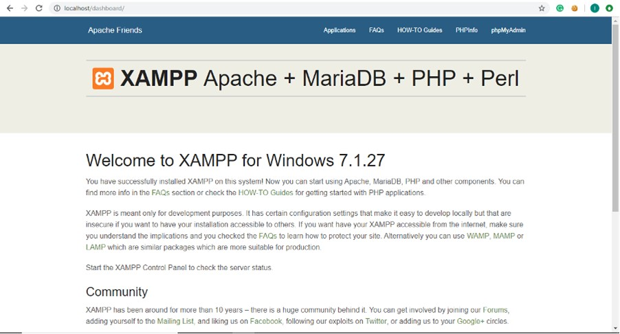

За сада, можеш обрисати садржај *htdocs* директоријума (али не бриши сам директоријум). У њему направи нови директоријум *Poglavlje2*. У овом директоријуму ћеш чувати изворни код свих HTML примера у наставку. Ако освежиш прозор веб-прегледача, добићеш приказ као на наредној слици.

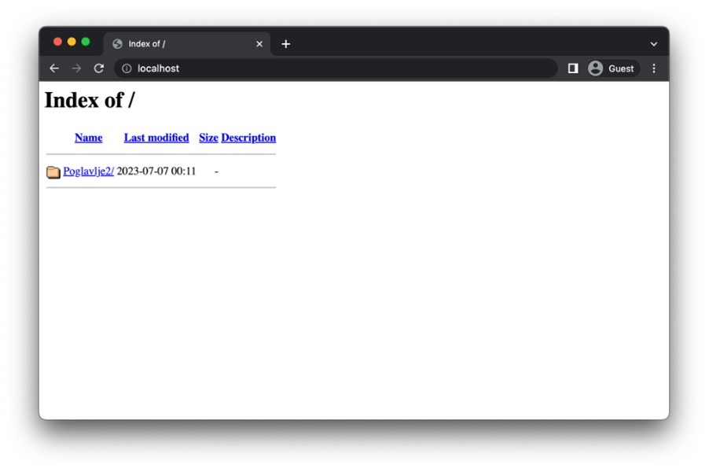
