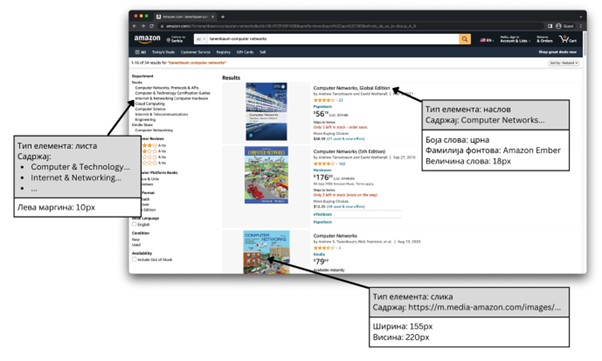

Организација веб-странице
=========================

У овом делу упознаћеш се са улогама језика HTML у развоју веб-сајтова и по чему се те улоге разликују од другог важног језика за развој веб-апликација, језика CSS.

Свака веб-страница коју посећујеш састоји се од две целине. То су: 

- Логичка структура: Основна сврха је описивање садржаја који чине неку веб-страницу и веза које се остварују међу тим садржајем. Логичка структура је тесно повезана са дизајном веб-странице.
- Визуална презентација: Односи се на својства садржаја која утичу на начин на који ће садржај бити приказан кориснику, као што су: величина, боје, позиција, величина текста, и многе друге. Визуалну презентацију диктирају аспекти веб-дизајна (метафора, тема и сценаристички план).

Ове две целине заједно дејствују како би се добио коначан приказ веб-странице и практично је немогуће замислити савремени веб-сајт који нема елементе обе целине. На пример, у дизајну веб-странице за прегледање информација о продаји на кванташким пијацама може се наћи табела која садржи податке о купљеним јабукама различитих врста. Опис садржаја табеле – број редова, број колона, садржај сваке ћелије – део је логичке структуре те веб-странице. Тема може приближније описати како ће та табела бити приказана корисницима – да ли ће имати посебно издвојен насловни ред, колика ће бити величина текста садржаја, да ли ће боја позадине ћелија табеле зависити од успеха продаје (на пример, висока продаја ће бити означена зеленом, а ниска продаја црвеном бојом) – и то чини део визуалне презентације те веб-странице.

Међутим, како је важно разумети да ове целине дејствују заједно тако их је важно и разграничити, односно разумети који елементи веб-странице представљају логичку структуру, а који елементи веб-странице представљају њену визуелну презентацију. Како би се инсистирало на раздвајању одговорности ових целина, током развоја веб технологија дошло је до развоја два језика за обележавање:

- Језик за обележавање хипертекста (*HyperText Markup Language, HTML*), служи за описивање логичке структуре веб-страница.
- Језик стилских листова (*Cascade Style Sheet, CSS*), служи за описивање визуелне презентације веб-страница.

.. learnmorenote:: Занимљивост:

    HTML и CSS сматрамо језицима за обележавање (*markup language*) уместо програмским језицима (*programming language*) због разлике у њиховим наменама. У програмске језике убрајамо језике чији су елементи довољно општи да омогућавају развој разноврсних апликација. Са друге стране, језици за обележавање су осмишљени за врло специфичну употребу у контексту развоја веб-апликација – они обогаћују текст како би вршили функцију за коју су намењени.

На наредној слици је приказана веб-страница претраге на веб-сајту *www.amazon.com*. Издвојена су три елемента те веб-странице: наслов, листа и слика. За сваки елемент је наведен његов структурни део (односно, оно што би било описано помоћу језика HTML) и његов визуални део (односно, оно што би било описано помоћу језика CSS).

