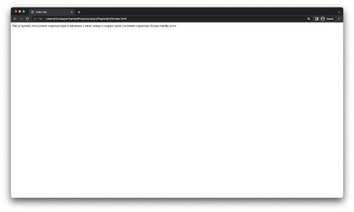

Синтакса језика HTML
====================

Упознајмо се прво са основним елементима језика HTML. Свака веб-страница се пише у документу који је написан у језику HTML (надаље ћемо говорити „HTML документ“), а која се састоји од HTML елемената (*еlement*). Сваки елемент има одређену сврху коју испуњава у циљу изградње логичке структуре HTML документа. Елементи се наводе коришћењем HTML етикета (*tag*), које имају два облика:

- Пар етикета, од којих се прва назива отварајућа етикета, а друга се назива затварајућа етикета. Отварајућа етикета се састоји од карактера „<“ и „>“ између којих се наводи назив HTML елемента. Затварајућа етикета се састоји од карактера „</“ и „>“ између којих се наводи назив HTML елемента. На пример, HTML елемент чији је назив h1 би се у HTML језику записао као пар етикета „<h1>“ и „</h1>“.
- Једна етикета, која се назива самозатварајућа етикета и састоји се од карактера „<“ и „>“ између којих се наводи назив HTML елемената. На пример, HTML елемент чији је назив img би се у HTML језику записао самозатварајућом етикетом „“.

Примети да самозатварајућа етикета има исти облик као отварајућа етикета. Ипак, важно је да научиш да их разликујеш, зато што сваки HTML елемент диктира који од ова два облика користи. На пример, погрешно би било HTML елемент *img* записати паром етикета „“ и „</img>“.

Занимљивост: У неким литературама ћеш пронаћи да се самозатварајуће етикете наводе као, на пример, „“. Међутим, иако је допуштено користити и овај облик, стандард не препоручује његово коришћење. Ми ћемо користити облике попут „“, као што смо и првобитно навели.

Сваки HTML елемент може бити додатно окарактерисан својствима којa приближније описују тај HTML елемент. На пример, HTML елементу који представља слику можемо навести очекивану ширину и висину у пикселима или HTML елементу који представља нумерисану листу можемо навести број од којег се започиње нумерација ставки те листе. Сва ова, али и многа друга својства, наводе се помоћу HTML атрибута (*attribute*). Сваки HTML атрибут има наредни облик:

::

    име=”вредност”

Име представља назив којим се идентификује одговарајуће својство елемента. Могућа имена зависе од сваког елемента. Приликом изучавања елемената упознаћеш и нека најчешћа својства чије је вредности могуће подесити помоћу одговарајућих HTML атрибута. Вредност атрибута представља вредност својства које се поставља навођењем тог атрибута. Неки атрибути имају подразумеване вредности, те није увек неопходно наводити све атрибуте за неки елемент, већ само онда када желиш да промениш подразумевано понашање.

HTML атрибути се наводе иза назива елемента и то искључиво у оквиру отварајуће етикете у случају елемената који се наводе паром етикета, односно у оквиру самозатварајуће етикете за оне елементе који их користе. Наредни примери представљају исправно навођење атрибута:

.. code-block:: HTML

    <form method=”GET”></form>
    

Са друге стране, наредни примери представљају неисправно навођење атрибута:

.. code-block::

    <method=”GET” form></form>    🡨 Навођење атрибута испред назива
    <form></form method=”GET”>    🡨 Навођење атрибута у затварајућој
                                    етикети

               🡨 Навођење вредности атрибута без 
                                    наводника

.. learnmorenote:: Занимљивост: 

    Одређени HTML елементи имају својства чије вредности могу бити „тачно“ или „нетачно“ (Булове вредности). Уколико својство има подразумевану вредност „нетачно“, онда је уместо експлицитног постављања вредности на „тачно“ могуће само навести име тог својства, чиме се вредност поставља на тачно. На пример, уместо навођења атрибута *required* за елемент *input* на следећи начин:

    <input required=”true”>

    могуће је навести само

    <input required>

Поред елемената и атрибута, синтаксу језика HTML чине и коментари (*comment*). Као и у другим програмским језицима, коментари су намењени да ближе предоче суштину изворног кода другим програмерима или за корисне напомене. Коментари се не процесирају нити приказују на веб-страницама. Коментари се у језику HTML наводе између карактера „<!--„ и „-->“ и могу бити вишелинијски. На пример:

.. code-block:: HTML

    <!-- Ovo je primer
    jednog višelinijskog
    komentara. -->

Важно је напоменути начин на који веб-прегледачи процесирају карактере белина у текстуалном садржају HTML докумената. Сви узастопни карактери белина, без обзира на то који карактери су у питању, замењују је тачно једним карактером размака. То значи да је, на пример, наредни код:

.. code-block:: HTML

    

    Ово је     пример
    текстуалног              садржаја
    који се        прожима у   више линија
    и садржи групе                 узастопних карактера белина
    између
    речи.
    

еквивалентан следећем коду:

.. code-block:: HTML

    

  Ово је пример текстуалног садржаја који се прожима у више линија и садржи групе узастопних карактера белина између речи.
    

односно, оба кода ће бити приказана на следећи начин:

С обзиром на то да синтакса језика HTML користи одређене карактере, навођење тих карактера у друге сврхе може створити проблеме у процесирању документа. Веб-прегледачи су имплементирани са изузетно великом робустношћу, што значи да чак и када HTML документ не садржи исправну синтаксу, веб-прегледач ће ипак покушати да процесира тај документ и прикаже некакав приказ у погледу. Међутим, ово може резултирати непожељним понашањем. Због тога је важно да се трудиш да пишеш исправне документе.

.. learnmorenote:: Занимљивост:

    Провера исправности HTML докумената се може извршити на веб-сајту `https://validator.w3.org/`. Постоје три начина да се неки документ провери: (1) навођењем URL адресе до документа, (2) похрањивањем документа са локалног уређаја и (3) директним уношењем HTML кода. На наредној слици је дат пример неисправног документа и списка грешака и упозорења које је валидатор приметио. Приликом коришћења овог веб-сајта, важно је одабрати опцију HTML5 (*experimental*) за опцију *Doctype* како би се користила последња верзија стандарда.

Приликом писања докумената у језику HTML важно је да имаш у виду специјалне карактере. Уместо навођења ових карактера директно, пожељно је користити одређене секвенце које веб-прегледачи разумеју. Ове секвенце неће бити приказане дословно, већ ће бити замењене одговарајућим симболима, при чему ће HTML документ остати валидан. Наредна табела приказује неке честе секвенце са њиховим описима.

+----------+--------------------------------+----------+
| Резултат | Опис                           | Секвенца |
+==========+================================+==========+
|          | (Непрекидни) Размак            |          |
+----------+--------------------------------+----------+
| <        | Мање од                        | &lt;     |
+----------+--------------------------------+----------+
| >        | Веће од                        | &gt;     |
+----------+--------------------------------+----------+
| &        | Амперсенд                      | &amp;    |
+----------+--------------------------------+----------+
| “        | Двоструки наводници            | &quot;   |
+----------+--------------------------------+----------+
| ‘        | Једноструки наводници/Апостроф | &apos;   |
+----------+--------------------------------+----------+