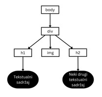
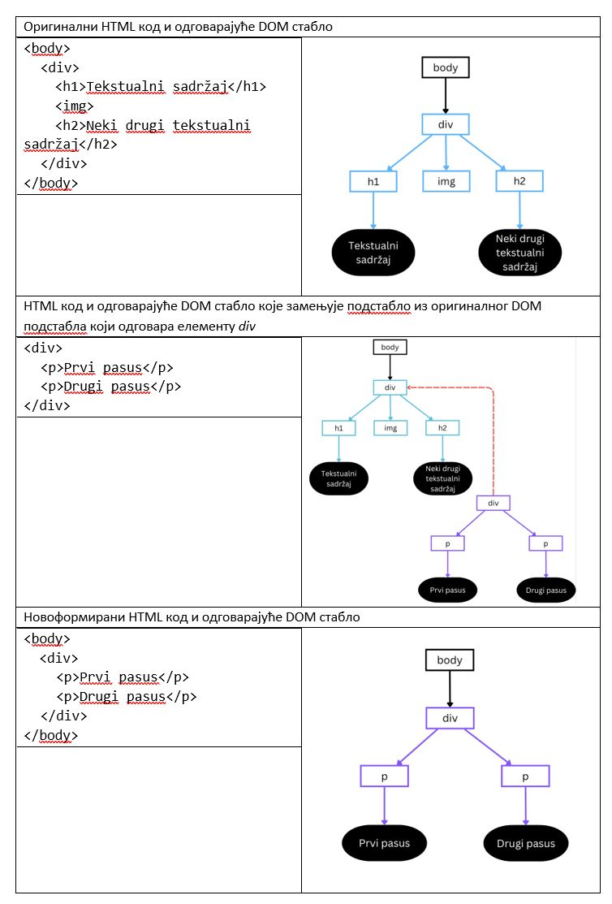
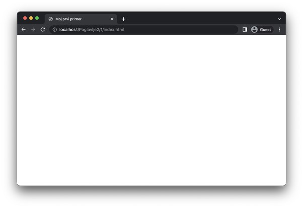
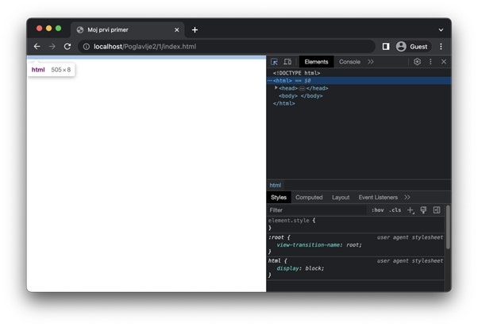
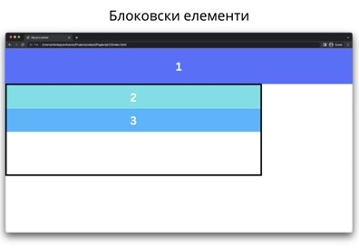
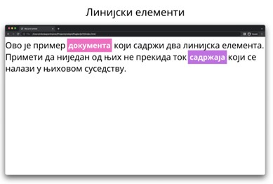

Структура веб-страница
======================

У овом делу ћеш сазнати како веб-прегледачи обрађују веб-странице, као и основне делове од којих се састоје веб-странице.

Модел објеката документа
________________________

Сигурно се питаш чему потреба за двама облицима навођења HTML eлемената. Одговор је у томе да елементи који користе парове етикета имају могућност да се између тих етикета наведе HTML садржај (*content*). У зависности од HTML елемента, HTML садржај може представљати „обичан“ текстуални садржај, али може бити и неки нови HTML елемент. Другим речима, HTML елементе је могуће угнежђавати једне у друге. На основу овога можеш закључити да HTML eлементи организују хијерархијску структуру. На пример, погледај наредни HTML код:

.. code-block:: HTML

    <body>
      

        <h1>Tekstualni sadržaj</h1>
        
        <h2>Neki drugi tekstualni sadržaj</h2>
      

    </body>

Хијерархијску организацију овог кода можемо представити помоћу стабла на наредни начин:

Веб-прегледачи приликом процесирања изворног кода HTML документа формирају хијерархијску структуру која одговара управо овој коју смо приказали. Стабло које настаје као резултат процесирања назива се модел објеката документа (*Document Object Model, DOM*) или DOМ стабло. Хијерархијска организација HTML документа омогућава једноставнију обраду коришћењем различитих алгоритама стабла. На пример, могуће је заменити једно подстабло неким потпуно другим подстаблом, чиме се добија сасвим нови HTML документ. Оваква обрада над чисто текстуалним обликом HTML документа би била изузетно спорија. Наредна слика илуструје пример замене једног DOM подстабла другим DOM подстаблом, чиме се формира ново целокупно DOM стабло.

Сви савремени веб-прегледачи нуде могућност приступа DOM стаблу из програмског кода. Ово ти омогућава да пишеш програме који управљају DOM стаблом на најразличитије начине. На ову чињеницу ћемо се вратити када будемо говорили о програмском језику *JavaScript*.

Заглавље веб-стране и метаподаци
________________________________

Основна структура сваког HTML документа дата је у наредном коду.

.. code-block:: html

    <!DOCTYPE html>
    <html>
        <head>
            <title>Moj prvi primer</title>
        </head>
    </html>

Декларација документа „<!DOCTYPE html>“ представља специјалну врсту елемента којом се дефинише верзија HTML документа која се користи. Конкретно, овом декларацијом наводимо да је HTML документ записан помоћу стандарда HTML5.

Изузимајући декларацију документа, елемент *html* представља главни, кажемо корени (*root*), елемент сваког HTML документа. Назив „корени“ долази од тога што представља корен HTML документа у DOM стаблу. Овај елемент има један важан атрибут, а то је атрибут *lang*, којим се дефинише језик садржаја документа. Навођење овог атрибута може утицати на то како ће веб-прегледач приказати неки садржај (на пример, навођење наводника се разликује у енглеском и српском језику). Његова вредност је код језика у складу са стандардом ISO 639-1. На пример, за енглески језик се користи вредност *en* (или нека од варијација попут *en-GB* за правила писања у Великој Британији, односно, *en-US* за правила писања у САД), док се за српски језик користи вредност *sr*. Списак кодова језика је могуће пронаћи на адреси *https://www.w3schools.com/tags/ref_language_codes.asp*. 

Корени елемент увек мора садржати макар једног потомка, а то је заглавље (*header* или *head*) документа, које се наводи елементом *head*. Заглавље садржи информације о самом документу. Ове информације служе да опишу документ и оне нису видљиве у погледу веб-прегледача. Примери информација су: наслов, опис, језик, аутор, кључне речи, итд. Поред информација о документу, у заглављу је могуће пронаћи референце ка спољним ресурсима, као што су изворни кодови језика CSS или *JavaScript*. О томе ћемо нешто више рећи касније.

У оквиру заглавља је, такође, неопходно навести наслов документа као текстуални садржај елемента *title*. Овај наслов ће се у већини савремених веб-прегледача приказати као име језичка у којем је документ отворен, али и у резултатима претраге.

Напиши код из претходног примера у свом омиљеном едитору и да сачувај написани код у датотеку на путањи „Poglavlje2/1/index.html“ у директоријуму *htdocs* XAMPP алата. Затим, отвори веб-прегледач и у адресној линији упиши путању „localhost/Poglavlje2/1/index.html“. Да ли ти се приказао празан поглед веб-прегледача? То је очекивано понашање, с обзиром на то да, као што смо рекли, ниједан елемент из заглавља HTML документа се не приказује у погледу. Уместо тога, погледај језичак веб-прегледача. У њему би требало да пронађеш текст „Мој први пример“.

.. questionnote:: 

    *Задатак*: Да ли знаш да је DOM стаблу могуће приступити из веб-прегледача? 

Да ли знаш да је DOM стаблу могуће приступити из веб-прегледача? Ако на веб-страници из претходног задатка отвориш алате за развој, приметићеш да постоји језичак који се зове *Elements* (у *Google Chrome* веб-претраживачу). Он ти нуди приказ DOM стабла у виду HTML кода. Кликом на неки HTML елемент можеш приметити да ће веб-прегледач означити тај елемент у погледу ради лакшег проналажења. Важно је да запамтиш да језичак *Elements* приказује тренутну верзију DOM стабла које је веб-прегледач конструисао приликом обрађивања HTML документа. Оно се не мора нужно поклапати са изворним HTML кодом датотеке (и у случају динамичких веб-страница, где постоји програмски код који мења HTML садржај, то готово увек није ни случај). Заправо, већ на овом првом примеру можеш приметити ово понашање. Наиме, савремени веб-прегледачи ће аутоматски додати још један HTML елемент документу из претходног примера, а то је елемент *body*, о којем ћеш убрзо прочитати нешто више. Дакле, језичак *Elements* је поприлично динамичке природе и на њега се можеш ослонити да ти прикаже текућу верзију твоје веб-странице, која може укључивати разна процесирања веб-прегледача.

Поред елемента *title*, важан елемент који се наводи у оквиру заглавља документа представља и елемент *meta*, којим је могуће навести различите информације о самом документу. Овај елемент се наводи уз атрибут *name*, који одређује тип информације и атрибут *content*, који наводи вредност дате информације. У наредној табели можеш видети неколико примера коришћења овог елемента.

+----------------+-------------------------------------------+----------------------------------------------------------------+
| Назив атрибута | Опис                                      | Пример употребе                                                |
+================+===========================================+================================================================+
| *language*     | Језик садржаја                            | <meta name="language" content="sr">                            |
+----------------+-------------------------------------------+----------------------------------------------------------------+
| *author*       | Имена или назив аутора                    | <meta name="keywords" lang="sr" content="веб, интернет, HTML"> |
+----------------+-------------------------------------------+----------------------------------------------------------------+
| *keywords*     | Кључне речи које су повезане са садржајем | <meta name="description" content="Primer HTML datoteke">       |
+----------------+-------------------------------------------+----------------------------------------------------------------+
| *description*  | Кратак опис садржаја                      | <meta name="description" content="Primer HTML datoteke">       |
+----------------+-------------------------------------------+----------------------------------------------------------------+
| *generator*    | Алат који је коришћен за писање           | <meta name="generator" content="Visual Studio Code">           |
+----------------+-------------------------------------------+----------------------------------------------------------------+

Специјално, елемент *meta* се користи за навођење кодне шеме која је коришћена приликом писања документа на следећи начин:

::

    <meta charset="utf-8">

Садржај веб-стране
___________________

Садржај документа који желиш да буде видљив кориснику у погледу веб-прегледача наводиш у оквиру елемента *body*. Практично посматрано, елемент *body* се може поистоветити са погледом веб-прегледача.

HTML елементе који описују садржај можемо поделити у две категорије које се разликују према начину приказивања и интеракције са другим елементима у документу. Те категорије су:

- Блоковски елементи (*block-level element*): То су елементи који се приказују читавом доступном ширином и креирају „блок“ на страници (отуда и њихов назив), тј. увек започињу у новом реду и померају садржај који их прати надоле. Блоковски елементи могу садржати друге блоковске елементе, као и линијске елементе.
- Линијски елементи (*inline-level element*): Ови елементи не формирају „блок“ на страници, већ теку у истој линији заједно са суседним садржајем (отуда и њихов назив) и не форсирају нове редове испред и иза садржаја. Линијски елементи заузимају само онолико ширине колико им је неопходно да прикажу садржај. Линијски елементи могу садржати само друге линијске елементе.

Наредна слика приказује пример понашања блоковских елемената. Блоковски елемент 1 заузима читаву ширину погледа и помера садржај који следи након њега у нови ред. Блоковски елементи 2 и 3 не заузимају читаву ширину погледа, пошто се налазе у оквиру елемента који има мању ширину (то је елемент са црним оквиром), али свакако заузимају читаву његову ширину (јер је то највећа ширина која им је доступна).

Са друге стране, наредна слика илуструје понашање линијских елемената. На њој можеш видети линијске елементе 1 и 2 који не прекидају ток садржаја (у овом случају, текста, око њих).

Постоје још неке разлике у понашању елемената из ових категорија, али њих ћеш упознати када будемо говорили о конкретним елементима и њиховим својствима. Велики број ових понашања је тесно повезан са визуелним елементима који се наводе језиком CSS.

Занимљивост: HTML5 верзија стандарда уводи нову категоризацију елемената која се заснива на типу садржаја који могу имати. Међутим, подела елемената на блоковске и линијске се традиционално користи у литератури јер је једноставнија за усвајање и разумевање понашања одређених елемената.
