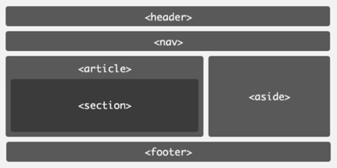

Груписање садржаја
==================

Хијерархијска организација елемената ти омогућава да групишеш разне елементе заједно у сврху означавања припадности једној логичкој целини. На пример, обавештење на друштвеној мрежи се може састојати од слике (која садржи јавну слику корисника који је иницирао обавештење), наслова (који садржи име и презиме корисника) и пасуса (који садржи опис обавештења). Наравно, ови елементи се могу директно записати у садржај документа, али груписање ових елемената под једним елементом нам омогућава да вршимо операције над родитељским елементом које ће бити прикладно примењене и на децу елементе (у контексту DOM стабла). На пример, сакривање обавештења се може имплементирати једном операцијом сакривања родитељског елемента уместо три операције сакривања деце елемената. Овакве елементе називамо елементима за груписање садржаја.

HTML5 стандард дефинише елементе за груписање садржаја којима је придружено одговарајуће значење. Неки од тих елемената (сви наведени елементи припадају блоковским елементима) и примери њихових употреба наведени су у наставку:

- Елемент `header` служи да групише елементе који припадају насловном садржају. У оквиру овог елемента су често садржани лого веб-сајта, навигација највишег нивоа, претрага појмова и сл.
- Елемент `nav` служи за груписање елемената који представљају навигациони садржај. То могу бити листе, везе, дугмићи и сл.
- Елемент `main` представља главни садржај веб-странице.
- Елемент `article` представља једну независну целину унутар веб-странице. На примеру блогова то могу бити појединачне објаве или објаве корисника на друштвеним мрежама. Садржај унутар овог елемента треба да има смисла сам по себи, чак и ако остатак садржаја на страници није доступан.
- Елемент `section` представља једну тематску целину. Типично се користи за организацију повезаног садржаја. За разлику од елемента `article`, овај елемент је општијег карактера. Примери употребе укључују поглавља, галерије фотографија и сл.
- Елемент `aside` се користи за обележавање садржаја који је повезан са главним садржајем, али се сматра споредним или независним од главног садржаја.
- Елемент `footer` представља подножје веб-странице и уобичајено садржи информације попут ауторских права, информације за контактирање аутора, везе ка друштвеним мрежама и сл.

Један пример употребе ових елемената дат је на наредној слици.

Још један блоковски елемент за груписање садржаја, али којем није придружено унапред-одређено значење, већ представља елемент опште намене јесте елемент div. Овај елемент се често користи за груписање елемената у логичке целине који имају специфично значење (на пример, обавештења на друштвеној мрежи), али и за функционалне целине (на пример, како би се применила иста операција на све елементе у оквиру дате групе).