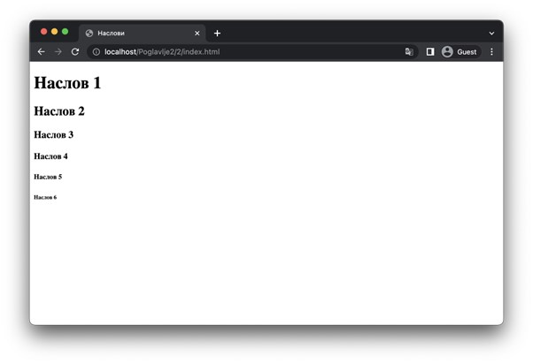
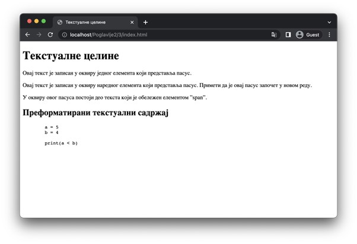
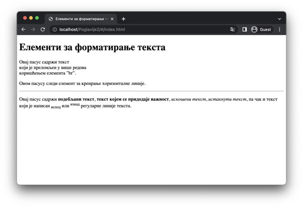
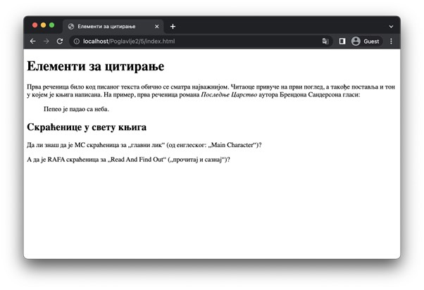

Обележавање текста
==================

Текстуални садржај представља практично незаобилазни део садржаја HTML докумената. Због своје разноврсности, HTML стандард прописује неколико елемената за обележавање текста, који се могу издвојити у наредне категорије:

- Наслови (*h1, h2, h3, h4, h5, h6*)
- Текстуалне целине (*p, span, pre*)
- Елементи за форматирање текста (*br, hr, b, strong, i, em, sub, sup*)
- Цитати (*blockquote, q, cite, abbr*)

Наслови се користе када желимо да именујемо неку логичку целину у садржају. У зависности од важности коју садржај има, за његов наслов треба одабрати одговарајући HTML елемент. Постоји шест елемената који представљају наслове (поднаслове, подподнаслове, итд.) и то су (поређани од најважнијег до најмање важног): *h1, h2, h3, h4, h5 и h6*. На пример, елемент h1 се углавном користи за наслов веб-странице, елемент h2 за најважније делове на веб-страници, итд. Сви наслови су блоковски елементи.

::

    Poglavlje2/2/index.html

За обележавање текстуалног садржаја првобитно се користе елементи *p* и *span*. Елемент *p* представља блоковски елемент за обележавање пасуса, односно једне текстуалне целине. За разлику од њега, елемент *span* представља линијски елемент за обележавање произвољног дела неког текста, обично једне речи, синтагме или дела реченице. Оба елемента се користе и за означавање функционалних целина на које ће деловати неки програмски код.

Већ знаш да веб-прегледач приликом процесирања HTML документа узастопне групе белина сматра тачно једним карактером размака. Међутим, некада је корисно да текстуални садржај приказује баш онако како је написан у односу на белине. У те сврхе се може користити елемент pre, који ће очувати значење белина у HTML садржају који се наведе под тим елементом.

::

    Poglavlje2/3/index.html

Зарад форматирања текста, могуће је користити и наредне HTML елементе:

- Елемент *br* користи се за преламање текста у наредни ред.
- Елемент *hr* користи се за навођење хоризонталне линије која се простире читавом доступном ширином.
- Елемент *b* користи се за подебљавање текста без придодавања посебног значаја тексту.
- Елемент *strong* користи се за навођење да текст који он обележава има велики значај.
- Елемент *i* користи се за дефинисање дела текста који се на неки начин издваја од остатка текста. Примери употребе укључују навођење: техничког термина, фраза из другог језика, мисли, промена перспективе, и др.
- Елемент *em* користи се за означавање истакнутог текста.
- Елемент *sub* користи се за означавање текста у потпису (тј. испод линије текста).
- Елемент *sup* користи се за означавање текста у натпису (тј. изнад линије текста).

::

    Poglavlje2/4/index.html

    
Посебно од интереса могу бити наредни елементи за цитирање:

- Елемент *blockquote* служи за навођење блоковских цитата.
- Елемент *q* служи за навођење линијских цитата.
- Елемент *cite* служи за навођење референци.
- Елемент *abbr* служи за навођење скраћеница.

::

    Poglavlje2/5/index.html

