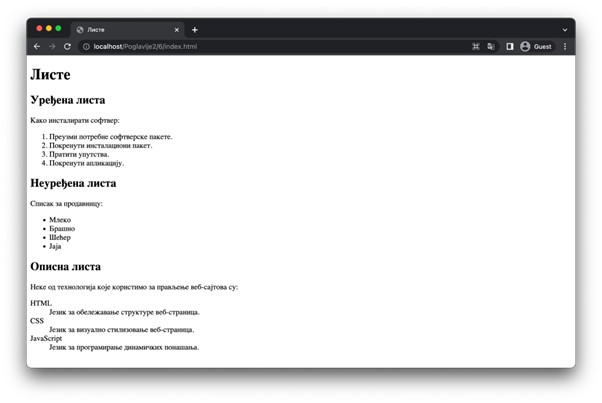
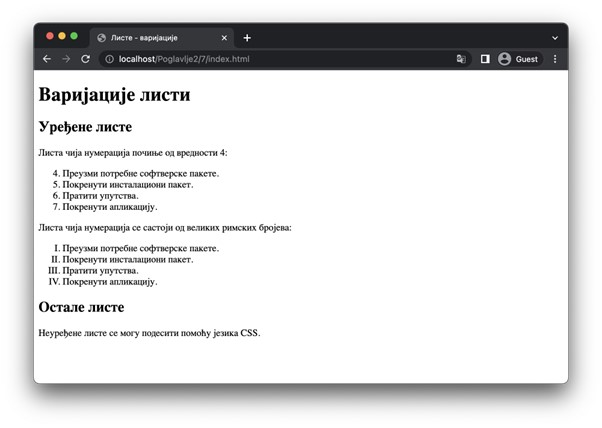
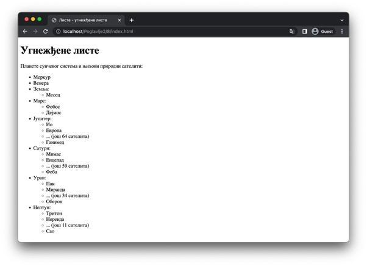

Листе
=====

Набрајање података, појмова, категорија и других ставки је веома често на веб-страницама. За обележавање било каквих секвенци погодно је користити листе. Постоје три врста листи:

- Уређене листе (*оrdered list*): Користе се за набрајање ставки листе у којима је поредак елемената важан. Ове листе обележавамо елементом *ol*. Овај елемент садржи један елемент *li* или више њих, од којих сваки представља по једну ставку те листе. 
- Неуређене листе (*unordered list*): Користе се за набрајање ставки листе у којима поредак елемената није важан. Ове листе обележавамо елементом *ul*. Овај елемент садржи један елемент *li* или више њих, од којих сваки представља по једну ставку те листе.
- Описне листе (*description list*): Користе се за набрајање појмова и њихових дефиниција, описа и сл. Сама листа се обележава елементом *dl*, док је свака ставка представљена са два елемента – елемент *dt* обележава сам појам који се описује (*data term*), а елемент *i* обележава опис тог појма (*data description*).

::

    Poglavlje2/6/index.html

Уређене листе подразумевано почињу са набрајањем од 1. Међутим, ово понашање је могуће изменити тако што се елементу *ol* промени вредност атрибута *start* на број од кога се започиње набрајање.

Такође, уређене листе подразумевано користе арапске бројеве за набрајање. Могуће је користити и неке друге нумерације променом вредности атрибута type елемента ol на неку од наредних вредности:

- *1*: арапски бројеви (подразумевано),
- *А*: велика слова енглеског алфабета,
- *а*: мала слова енглеског алфабета,
- *I*: велики римски бројеви,
- *i*: мали римски бројеви.

Напоменимо да се језиком CSS могу поставити и друге нумерације. (Укупно их има чак 17!)

::

    Poglavlje2/7/index.html

С обзиром на то да су ставке листе блоковски елементи (као и саме листе), садржај неке ставке могу бити разни други елементи, па и саме листе. Дакле, листе је могуће угнежђавати једне у друге.

::

    Poglavlje2/8/index.html

