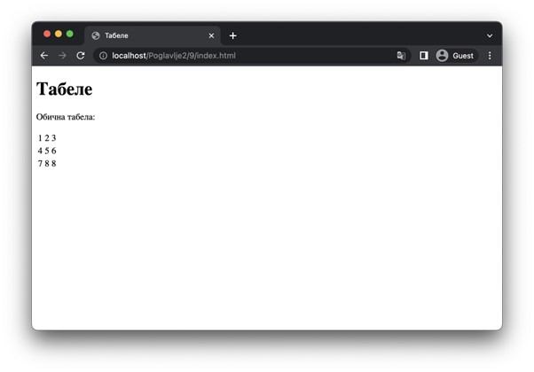
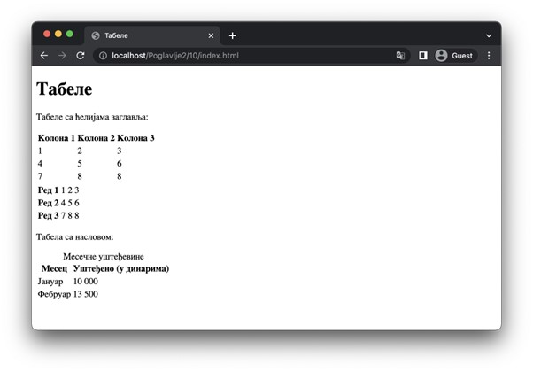
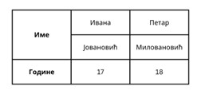
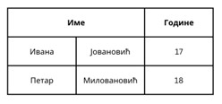
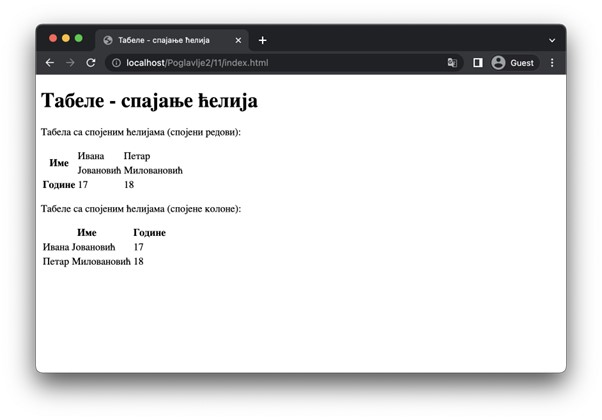

Табеле
======

Дводимензионални подаци се најједноставније приказују у виду табела. Језик HTML има подршку за приказивање табела, међутим, постоји једна важна разлику између класичног схватања табела и начина на које су оне осмишљене у језику HTML. Традиционално, табеле посматрамо као матрице података – сваки податак је представљен пресеком једне врсте и једне колоне. За разлику од овог приступа, у језику HTML табеле посматрамо као секвенце редова података (што се природно пресликава у одговарајуће елементе). Другим речима, табела се састоји од једног реда или више њих, при чему сваки ред има једну ћелију или више њих.

Основни елемент за представљање табела јесте елемент *table*, који обележава једну табелу. Његов садржај чине, као што смо већ рекли, елементи *tr*, од којих сваки представља један ред табеле (*table row*). Даље, садржај ових елемената представља једнак број елемената *td* од којих сваки садржи по један податак (*table data*).

::

    Poglavlje2/9/index.html

Ћелије не морају бити само подаци, већ могу садржати и описе одговарајућих колона, односно редова. Те описе називамо заглавља и представљамо их елементима *th* (*table header*), који се наводе у оквиру редова, попут елемената *td*. Заглавља обично користиш када желиш да ближе опишеш садржај колона, односно редова табеле.

Корисно је да целој табели придружиш наслов када желиш да опишеш шта подаци у некој табели представљају. У ту сврху можеш да употребиш елемент *caption*, који садржи наслов табеле. Врло је важно да запамтиш да се овај елемент наводи увек као први потомак елемента *table*, пре било којих других елемената.

::

    Poglavlje2/10/index.html

Често је потребно да извршимо спајање ћелија. На наредној слици дат је пример табеле са подацима о ученицима. Примети да прво заглавље (које садржи реч „Име“) заузима (кажемо још и да се простире преко (*span*)) простор за две ћелије (тј. за два реда). Да бисмо ово понашање обележили у језику HTML, на располагању нам стоји атрибут *rowspan*, који се наводи на елементима *td* или *th*. Његова вредност је број ћелија (тј. редова) преко кога ће се елемент простирати. Да би понашање било коректно, потребно је да у наредним редовима обришеш елементе преко којих се овај елемент простире.

Слично понашање је могуће извршити и за простирање ћелија преко колона, с том разликом да се користи атрибут *colspan*. Наредна слика илуструје пример табеле који садржи ћелију која се простире преко две колоне.

::

    Poglavlje2/11/index.html

.. image:: ../../_images/slika_64e.jpg
    :width: 780
    :align: center

Можеш да се увериш да се заглавље „Име“ заиста простире преко, на пример, две колоне у другој табели, посматрањем одговарајућег елемента *th* у језичку *Еlements* алата за развој.

