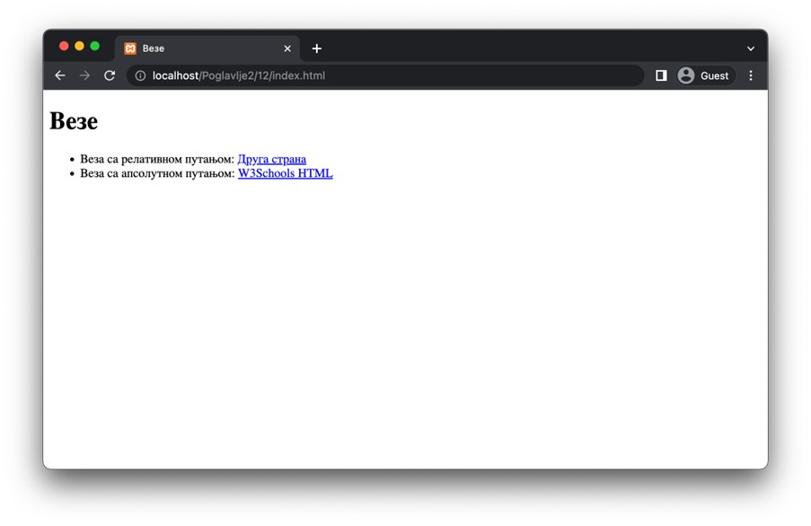
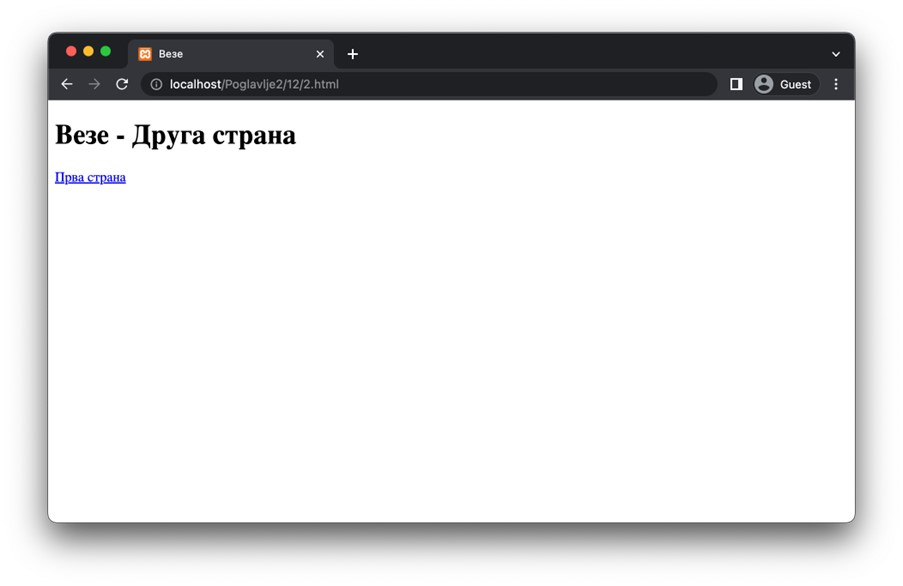
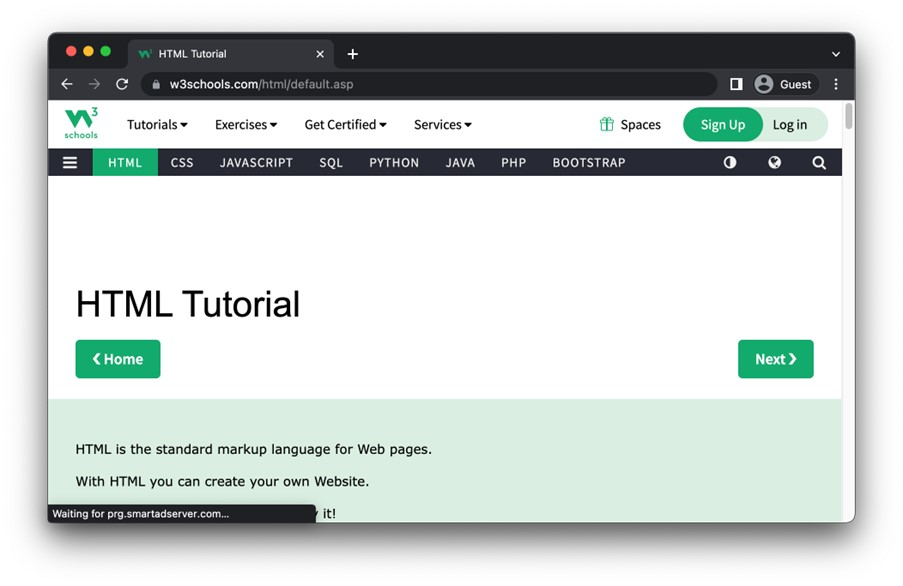
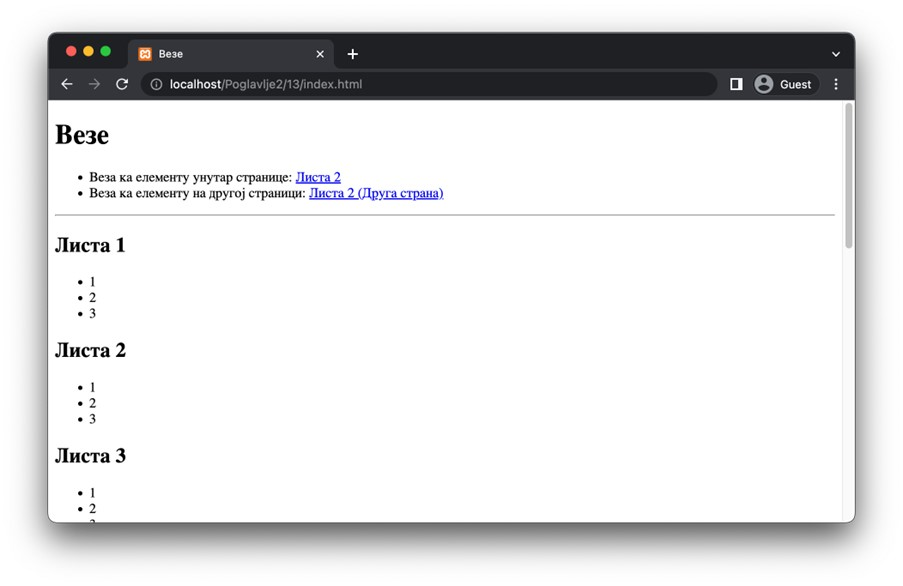
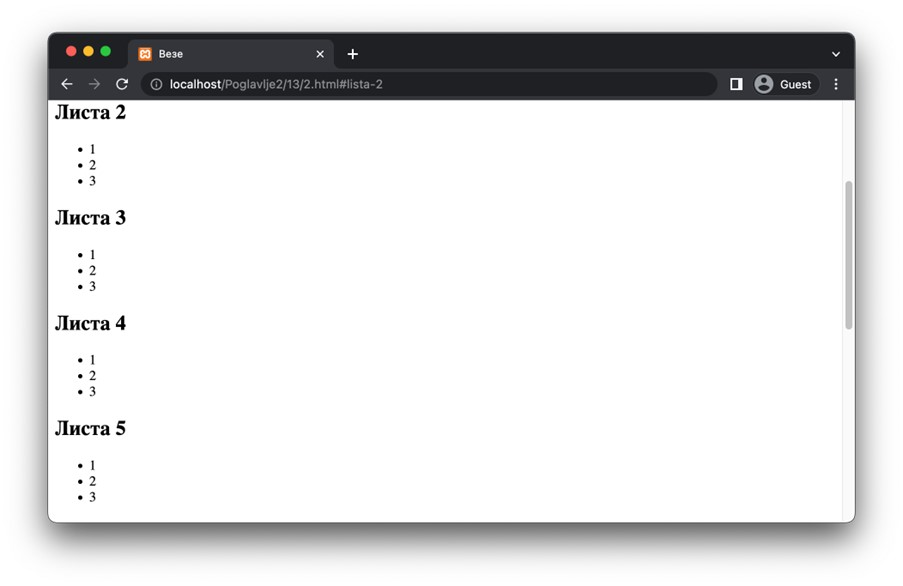
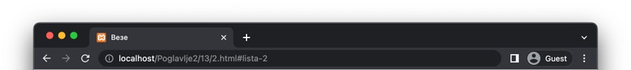
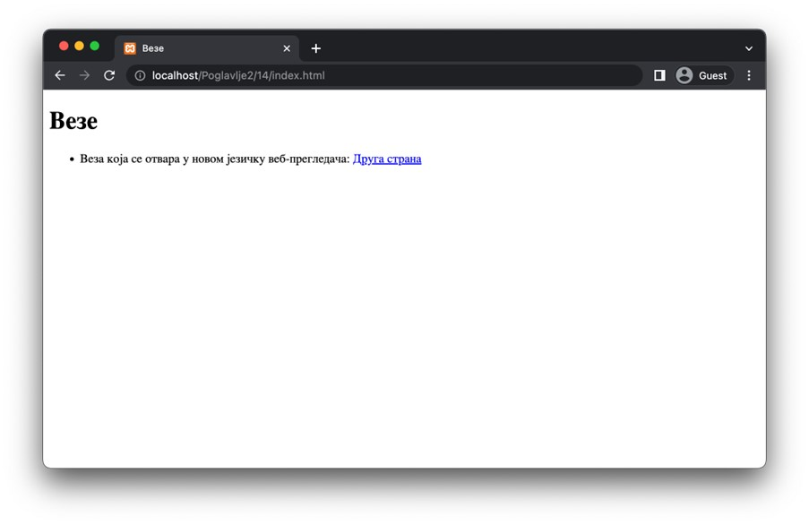
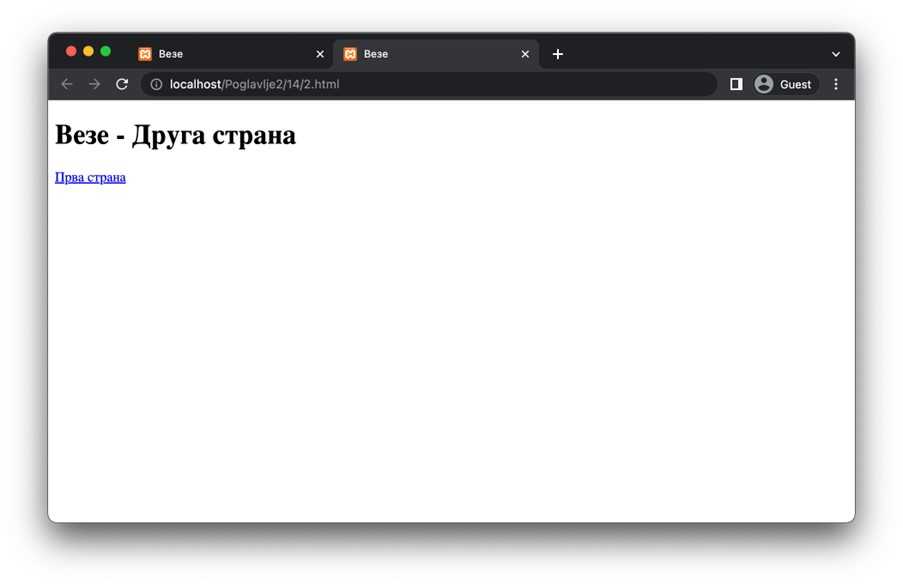

Везе и адресе
=============

Везе су линијски елементи који служе за повезивање ресурса на вебу, махом веб-страница или њихових фрагмената, али и других ресурса. Заправо, везе представљају окосницу хипертекста, с обзиром на то да се управо овим елементима омогућава нелинеарност конзумирања садржаја.

Уколико желиш да додаш везу ка неком ресурсу на веб-страници, потребно је да на месту где веза треба да се појави користиш елемент a (аnchor). Атрибут href представља једини обавезни атрибут чија је вредност путања до ресурса који се увози. Путања може бити релативна у односу на адресу веб-странице или апсолутна (тј. могуће је навести произвољну URL адресу).

Наредна веб-страница садржи две везе које илуструју коришћење обе врсте адреса.

.. code-block:: html

    <!-- Poglavlje2/12/index.html -->

    <!DOCTYPE html>
    <html lang="sr">
    <head>
        <meta charset="utf-8">
        <title>Везе</title>
    </head>
    <body>
        <h1>Везе</h1>

        <ul>
        <li>
            Веза са релативном путањом:
            <a href="./2.html">Друга страна</a>
        </li>
        <li>
            Веза са апсолутном путањом:
            <a href="https://www.w3schools.com/html/default.asp">W3Schools HTML</a>
        </li>
        </ul>
    </body>
    </html>

Прва веза води ка документу **2.html** који се налази у истом директоријуму:

.. code-block:: html

    <!-- Poglavlje2/12/2.html -->
    
    <!DOCTYPE html>
    <html lang="sr">
    <head>
        <meta charset="utf-8">
        <title>Везе</title>
    </head>
    <body>
        <h1>Везе - Друга страна</h1>

        <a href="./index.html">Прва страна</a>
    </body>
    </html>

Друга веза води ка веб-страници на удаљеном серверу:

Присети се да URL адресе могу садржати фрагменте. Навођење фрагмента у оквиру URL адресе у већини савремених веб-прегледача значи да ће веб-прегледач покушати да пронађе елемент чији атрибут *id* има вредност тог фрагмента и аутоматски ће померити поглед тако да тај елемент буде видљив.

.. learnmorenote:: Занимљивост:

 Ето још једног разлога зашто идентификатори морају бити јединствени у оквиру веб-странице. У супротном, веб-прегледач може да фокусира елемент који нисмо очекивали.

Наредна веб-страница садржи две везе од којих једна води ка елементу у оквиру исте веб-странице (једноставно, навођењем само фрагмента), док друга води ка елементу у оквиру неке друге веб-странице (навођењем фрагмента уз путању, која је у овом случају релативна, али једнако функционише и уз апсолутне путање).

.. code-block:: html

    <!-- Poglavlje2/13/index.html -->
    
    <!DOCTYPE html>
    <html lang="sr">
    <head>
        <meta charset="utf-8">
        <title>Везе</title>
    </head>
    <body>
        <h1>Везе</h1>

        <ul>
        <li>
            Веза ка елементу унутар странице:
            <a href="#lista-2">Листа 2</a>
        </li>
        <li>
            Веза ка елементу на другој страници:
            <a href="./2.html#lista-2">Листа 2 (Друга страна)</a>
        </li>
        </ul>

        

        <h2 id="lista-1">Листа 1</h2>
        <ul>
        <li>1</li>
        <li>2</li>
        <li>3</li>
        </ul>

        <h2 id="lista-2">Листа 2</h2>
        <ul>
        <li>1</li>
        <li>2</li>
        <li>3</li>
        </ul>

        <h2 id="lista-3">Листа 3</h2>
        <ul>
        <li>1</li>
        <li>2</li>
        <li>3</li>
        </ul>

        <h2 id="lista-4">Листа 4</h2>
        <ul>
        <li>1</li>
        <li>2</li>
        <li>3</li>
        </ul>

        <h2 id="lista-5">Листа 5</h2>
        <ul>
        <li>1</li>
        <li>2</li>
        <li>3</li>
        </ul>
    </body>
    </html>

Код за другу страницу је дат у наставку.

.. code-block:: html

    <!-- Poglavlje2/13/2.html -->
    
    <!DOCTYPE html>
    <html lang="sr">
    <head>
        <meta charset="utf-8" />
        <title>Везе</title>
    </head>
    <body>
        <h1>Везе - Друга страна</h1>

        <a href="./index.html">Прва страна</a>

        

        <h2 id="lista-1">Листа 1</h2>
        <ul>
        <li>1</li>
        <li>2</li>
        <li>3</li>
        </ul>

        <h2 id="lista-2">Листа 2</h2>
        <ul>
        <li>1</li>
        <li>2</li>
        <li>3</li>
        </ul>

        <h2 id="lista-3">Листа 3</h2>
        <ul>
        <li>1</li>
        <li>2</li>
        <li>3</li>
        </ul>

        <h2 id="lista-4">Листа 4</h2>
        <ul>
        <li>1</li>
        <li>2</li>
        <li>3</li>
        </ul>

        <h2 id="lista-5">Листа 5</h2>
        <ul>
        <li>1</li>
        <li>2</li>
        <li>3</li>
        </ul>
    </body>
    </html>

    

Ако кликнеш, на пример, на другу везу, веб-прегледач ће учитати другу веб-страницу и померити поглед тако да елемент са идентификатором који одговара фрагменту буде на врху погледа.

Примети да се у адресној линији појављује фрагмент:

У зависности од вредности наредних атрибута примењених над елементом a, веза може имати различите карактеристике:

- Атрибут *target* одређује на који начин ће веб-прегледач обрадити захтев. Наредна табела илуструје могуће вредности и њихово понашање. 

+----------------------------+-------------------------------------------------------------------------------------------------------+
| Вредност атрибута *target* | Понашање                                                                                              |
+============================+=======================================================================================================+
| *_self* (подразумевано)    | Ресурс ће бити отворен у истом прозору/језичку у којем је документ који садржи везу која је отворена. |
+----------------------------+-------------------------------------------------------------------------------------------------------+
| *_blank*                   | Ресурс ће бити отворен у новом прозору/језичку.                                                       |
+----------------------------+-------------------------------------------------------------------------------------------------------+
| *_parent*                  | Ресурс ће бити отворен у родитељском оквиру. (Користи се у угнежђеним документима.)                   |
+----------------------------+-------------------------------------------------------------------------------------------------------+
| *_top*                     | Ресурс ће бити отворен у целом садржају прозора. (Користи се у угнежђеним документима.)               |
+----------------------------+-------------------------------------------------------------------------------------------------------+

- Атрибут *hreflang* диктира језик увезеног веб-ресурса.
- Атрибут *type* означава тип увезеног веб-ресурса.

.. code-block:: html

    <!-- Poglavlje2/14/index.html -->
    
    <!DOCTYPE html>
    <html lang="sr">
    <head>
        <meta charset="utf-8">
        <title>Везе</title>
    </head>
    <body>
        <h1>Везе</h1>

        <ul>
        <li>
            Веза која се отвара у новом језичку веб-прегледача:
            <a href="./2.html" target="_blank">Друга страна</a>
        </li>
        </ul>
    </body>
    </html>

Код за другу страницу је дат у наставку.

.. code-block:: html

    <!-- Poglavlje2/14/2.html -->
    
    <!DOCTYPE html>
    <html lang="sr">
    <head>
        <meta charset="utf-8" />
        <title>Везе</title>
    </head>
    <body>
        <h1>Везе - Друга страна</h1>

        <a href="./index.html">Прва страна</a>
    </body>
    </html>

Кликом на везу можеш приметити да се отворио нови језичак веб-прегледача:

