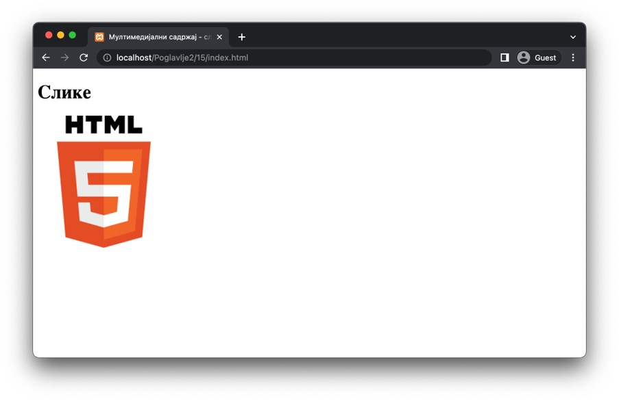
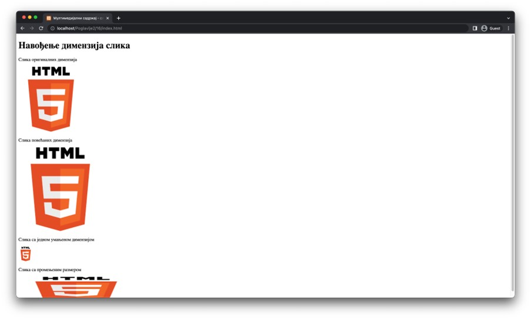
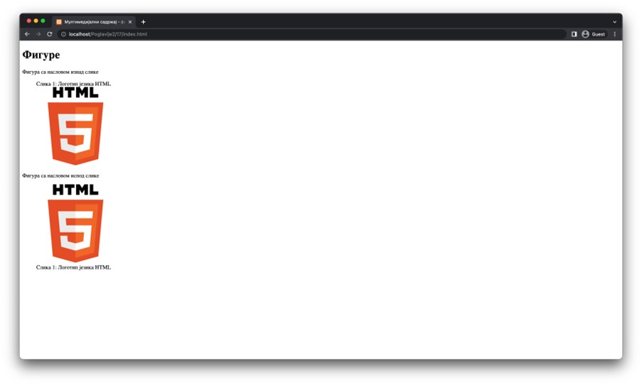

Слике
=====

Слике често представљају незаобилазни елемент веб-страница, с обзиром на њихову широку примену у приказивању информација.

Најосновнији начин да укључиш слику у садржај веб-странице јесте помоћу линијског елемента *img* (који се наводи самозатварајућом етикетом). Слика која треба да се прикаже се наводи као вредност атрибута src у виду путање (која, попут веза, може бити релативна и апсолутна).

Поред овог атрибута, елемент *img* има и један важан обавезни атрибут. Мотивација за увођење овог атрибута долази од чињенице да нису сви људи у стању да конзумирају визуални садржај. Међутим, важно је да веб-странице прилагодиш тако да сви могу да конзумирају твоју веб-страницу. Ово је могуће посредством алата који се називају читачи екрана (*screen reader*). Ови алати обрађују HTML код веб-странице и диктирају обрађени садржај. Међутим, читачи екрана не обрађују мултимедијални садржај попут слика. Због тога, потребно је да наводиш опис садржаја на свакој слици коју укључиш у веб-страницу. Ово можеш урадити користећи атрибут *alt* за чију вредност можеш да наведеш било који текстуални опис слике. Трудећи се да пишеш квалитетне описе слика умногоме помажеш и оним људима који конзумирају садржај твоје веб-странице на алтернативни начин.

.. learnmorenote:: Занимљивост:

    HTML стандард заговара приступачност (*accessibility*) садржаја и на друге начине. Неке главне смернице можеш пронаћи на адреси https://www.w3schools.com/html/html_accessibility.asp.

::

    Poglavlje2/15/index.html

Слика коју укључиш у документ ће се приказати у димензијама које би та слика имала на диску. Ако желиш да промениш величину слике, то можеш урадити атрибутима *width* и *height*, чије су вредности бројеви који представљају димензије за ширину и висину, редом. Уколико наведеш само једну од тих димензија, другу димензију ће аутоматски израчунати веб-прегледач тако да размер слике (*аspect ratio*) остане непромењен. Са друге стране, ако наведеш димензије тако да размер слике буде промењен, слика може одати утисак као да је „развучена“.

Ипак, сматра се добром праксом навођење оба атрибута зато што слика може бити довучена са закашњењем. Наиме, веб-прегледач по дохватању HTML документа и његовом обрађивању одмах започиње приказивање елемената, без обзира на то да ли су садржаји тих елемената доступни или не (на пример, да ли је слика преузета са веб-сервера). Ово се ради због тога што, ако би се првобитно чекало на добављање свих ресурса, приказивање веб-странице би започело тек неколико секунди (или, чак, минута) након што корисник унесе адресу веб-странице коју жели да посети. У том случају, корисник би имао утисак да веб-страница не може да се учита и могао би одустати од посете. Примере овог понашања у пракси можеш видети на веб-страницама које имају велики број ресурса или уколико твоја конекција ка серверу има ниску пропусност.

::

    Poglavlje2/16/index.html

Слике су често праћене описима. Уколико желиш да придружиш некој слици одређени опис, то можеш урадити коришћењем блоковских елемената *figure* и *figcaption*. Први елемент служи да дефинише простор за слику која ће бити описана, а други елемент садржи сам опис. У зависности од редоследа навођења, опис може доћи пре или након слике.

::

    Poglavlje2/17/index.html

