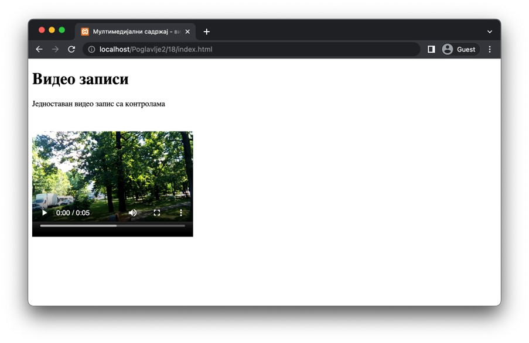

Видео записи
============

Још један атрактиван начин за конзумирање садржаја јесте путем видео-записа. Иако постоји велики број формата за складиштење видео-записа, HTML стандард подржава три формата који су наведени у наредној табели. Сви формати су подржани од стране савремених веб-прегледача, осим веб-прегледача *Safari*, који не подржава *Оgg* формат.

+---------------+------------------------------+--------------+
| Назив формата | Екстензија датотеке на диску | Тип ресурса  |
+===============+==============================+==============+
| *MP4*         | *.mp4*                       | *video/mp4*  |
+---------------+------------------------------+--------------+
| *WebM*        | *.webm*                      | *video/webm* |
+---------------+------------------------------+--------------+
| *Ogg*         | *.ogg*                       | *video/ogg*  |
+---------------+------------------------------+--------------+

Видео-записе је могуће укључити у HTML садржај навођењем елемента *video*. Атрибути *width* и *height* служе за навођење димензија видео-записа, док навођење (Буловог) атрибута *controls* служи како би веб-прегледач укључио контролне дугмиће за репродукцију, као што су дугме за пуштање/паузирање, дугме за управљање јачином звука (уколико видео-запис садржи звук) и др.

Навођење ресурса који представља видео-запис који желиш да се прикаже на веб-страници се врши елементом *source*, који се наводи као садржај елемента video. Елемент *source* садржи атрибут src, чија је вредност, попут елемента *img*, путања до ресурса. Додатно, важно је да наведеш атрибут type, који представља тип ресурса који се укључује. 

Приметићеш у наредном примеру да је могуће навести више елемената *source* за један елемент video. То је због тога што, ако први видео-запис није подржан од стране веб-прегледача, онда ће веб-прегледач покушати да прикаже други видео-запис. Ако ни њега није могуће приказати, биће покушано са трећим, итд. Због тога, пракса је да се након свих *source* елемената наведе неки HTML садржај који ће бити приказан у случају да није могуће приказати ниједан од видео-записа.

.. code-block:: html

    <!-- Poglavlje2/18/index.html -->
    
    <!DOCTYPE html>
    <html lang="sr">
    <head>
        <meta charset="utf-8">
        <title>Мултимедијални садржај - видео записи</title>
    </head>
    <body>
        <h1>Видео записи</h1>

        
Једноставан видео запис са контролама

        <video width="320" height="240" controls>
        <source src="./city-park.mp4" type="video/mp4">
        <source src="./city-park.webm" type="video/vebm">
        Твој веб-прегледач не подржава елемент ”video”.
        </video>
    </body>
    </html>

Додатни (Булови) атрибути које можеш да наведеш за елемент *video* су:

- Атрибут *autoplay*, којим се наводи веб-прегледачу да видео-запис буде аутоматски пуштен након што се учита. Ипак, на ово не треба да се ослањаш јер ће већина савремених веб-прегледача игнорисати ово понашање због лошег корисничког доживљаја (осим, евентуално, уколико звук на видео-запису није утишан). 
- Атрибутом *muted* се наводи веб-прегледачу да звук на видео-запису подразумевано треба да буде угашен.

.. code-block:: html

    <!-- Poglavlje2/19/index.html -->
    
    <!DOCTYPE html>
    <html lang="sr">
    <head>
        <meta charset="utf-8">
        <title>Мултимедијални садржај - видео записи</title>
    </head>
    <body>
        <h1>Видео записи</h1>

        
Видео запис који се пушта аутоматски и утишан

        <video width="320" height="240" controls autoplay muted>
        <source src="./city-park.mp4" type="video/mp4">
        <source src="./city-park.webm" type="video/vebm">
        Твој веб-прегледач не подржава елемент ”video”.
        </video>
    </body>
    </html>

