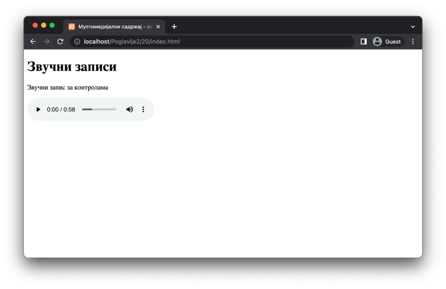

Звучни записи
=============

Иако видео-записи могу садржати звук, некада желимо да омогућимо кориснику само преслушавање звучних записа. HTML стандард подржава преслушавање звучних записа у форматима који су наведени у наредној табели.

+---------------+------------------------------+--------------+
| Назив формата | Екстензија датотеке на диску | Тип ресурса  |
+===============+==============================+==============+
| *MP3*         | *.mp3*                       | *audio/mpeg* |
+---------------+------------------------------+--------------+
| *WAV*         | *.wav*                       | *audio/wav*  |
+---------------+------------------------------+--------------+
| *Ogg*         | *.ogg*                       | *audio/ogg*  |
+---------------+------------------------------+--------------+

Звучни записи се укључују коришћењем елемента *audio*, који има идентично понашање као и елемент *video*, као и исте атрибуте. Наредни пример илуструје коришћење овог елемента за репродукцију звучних записа.

.. code-block::

    <!DOCTYPE html>
    <html lang="sr">
    <head>
        <meta charset="utf-8">
    </head>
    <title>Мултимедијални садржај - звучни записи</title>
    <body>
        <h1>Звучни записи</h1>

        
Звучни запис за контролама

        <audio controls>
        <source src="./melody.mp3" type="audio/mp3">
        Твој веб-прегледач не подржава елемент audio”.
        </video>
    </body>
    </html>

