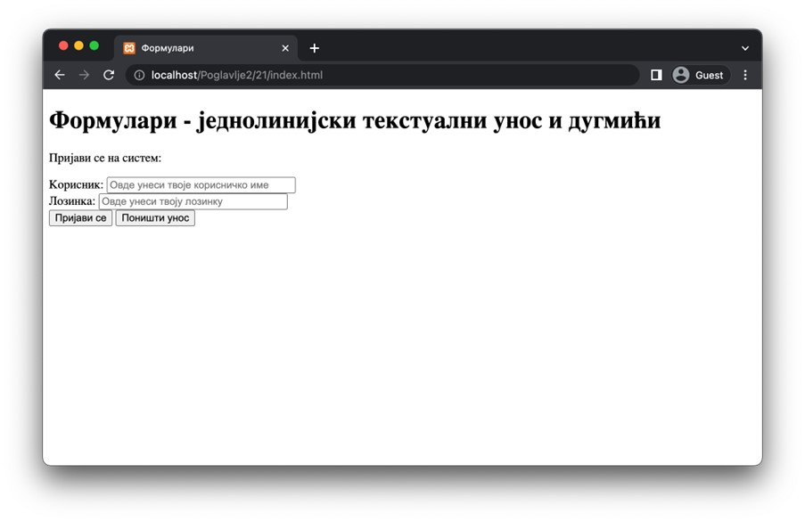
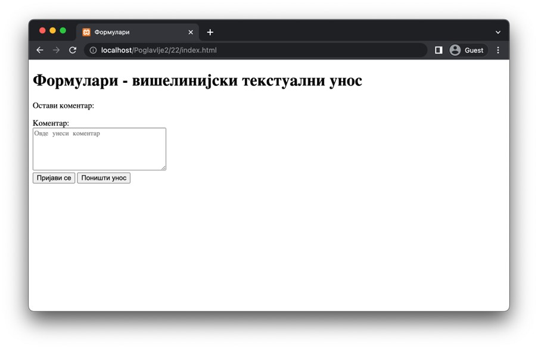

Поља за уност текста и дугмићи
==============================

Основно поље за унос података јесте једнолинијско текстуално поље, које је представљено линијским елементом *input* са самозатварајућом етикетом. Овај елемент ће имати различите карактеристике у зависности од вредности атрибута *type*. Погледај за сада следеће елементарне типове које је могуће навести као вредност атрибута *type*, па ћеш у наставку лекције проширити овај списак новим типовима:

- Вредност *text* означава да је реч о текстуалном пољу без посебних карактеристика. Уколико желимо да омогућимо кориснику да уноси произвољан кратак текст, можемо искористити овај тип.
- Вредност *password* означава да је реч о текстуалном пољу чије је карактере пожељно визуелно прикрити како трећа лица из окружења корисника не би видела текст који корисник уноси. Најраспрострањенија употреба овог типа јесте за унос лозинки, пин-бројева и других сигурносних кључева. Веб-прегледачи ће унети текст приказати у виду тачака, звезди и сличних симбола. Ипак, то не значи да је тај текст заиста прикривен у потпуности.

Поред атрибута *type*, елемент *input* има још неке атрибуте који су вредни помене:

- Атрибут *name* је важно навести због тога што се њиме дефинише назив податка (односно, унете вредности тог поља) који ће бити прослеђен веб-серверу на обраду. Важно је одабрати јасна имена, која правилно осликавају садржину податка. На пример, имена могу имати вредности *ime, prezime, godine*, уместо *podatak1, podatak2, podatak3*.
- Атрибут *value* садржи вредност коју је корисник унео у поље. Овај атрибут није обавезно навести, осим ако не желимо да дефинишемо подразумевану вредност поља. 
- (Булов) атрибут *required*, ако се наведе, означава да је у питању поље које корисник мора да попуни пре подношења формулара. Ако поље није попуњено, неки веб-прегледачи ће зауставити подношење формулара. Ипак, на ово понашање веб-прегледача не треба да се ослониш. Због тога ћеш у лекцији о програмском језику *JavaScript* видети како можеш да провериш податке пре подношења формулара који ради у свим савременим веб-прегледачима.
- Атрибут *minlength* дефинише најмању дужину текста коју то поље захтева. Веб-прегледач може, али не мора, зауставити подношење формулара уколико поље не испуњава тај захтев.
- Атрибут *maxlength* дефинише највећу дужину текста коју то поље захтева. Веб-прегледач може, али не мора, зауставити подношење формулара уколико поље не испуњава тај захтев.
- Атрибут *placeholder* садржи текстуалну поруку која ће бити приказана у пољу. Овај текст се најчешће користи као помоћ кориснику и не представља вредност поља која ће бити послата веб-серверу на обраду.
- Атрибут *size* дефинише дужину поља у карактерима.

Поред типова које смо навели изнад, посебно се издвајају наредна три типа која ће бити приказана у виду дугмића са различитим карактеристикама:

- Вредност *button* означава да је у питању дугме које нема унапред дефинисано понашање. Уместо тога, понашање се дефинише програмским кодом у језику *JavaScript*. О овоме ће бити више речи када будемо говорили о овом програмском језику. Ово дугме се користи када очекујемо од корисника да изврши неку акцију на нивоу веб-странице (на пример, да дохвати нове податке пре него што настави попуњавање формулара, да укључи или искључи одређене вредности из формулара, итд.).
- Вредност *submit* означава да је у питању дугме које корисник треба да притисне ради подношења формулара.
- Вредност *reset* означава да је у питању дугме које ће поништити текуће вредности које су унете у формулар. Другим речима, вредности поља формулара ће бити постављене на почетне вредности.

С обзиром на то да се елемент *input* наводи самозатварајућом етикетом, текстуални садржај који ће бити приказан на овим дугмићима можеш да поставиш тако што жељени текст наведеш као вредност атрибута *value*. Приликом подношења формулара за дугмиће неће бити послате њихове вредности, тако да није неопходно да наводиш атрибут *name*. У свим осталим случајевима, као што смо већ рекли, очекује се да овај атрибут буде наведен.

Још један користан HТМL елемент који се може пронаћи у садржају јесте линијски елемент *label*, који дефинише ознаку за неко текстуално поље. Он се најчешће користи како би се кориснику појаснило који подаци се од њега очекују у одговарајућем пољу. Елемент *label* можеш придружити неком текстуалном пољу тако што за вредност атрибута for елемента *label* наведеш идентификатор који је придружен одговарајућем текстуалном пољу.

Наредни пример илуструје елементе о којима је било речи у сврху креирања једноставног формулара за пријављивање корисника на систем.

.. petlja-editor:: Poglavl2/21/index.html

    index.html
    <!DOCTYPE html>
    <html lang="sr">
    <head>
        <meta charset="utf-8">
    </head>
    <title>Формулари</title>
    <body>
        <h1>Формулари - једнолинијски текстуални унос и дугмићи</h1>

        
Пријави се на систем:

        <form>
        <label for="korisnicko-ime">Корисник:</label>
        <input
            id="korisnicko-ime"
            type="text"
            name="korisnik"
            required
            minlength="3"
            maxlength="15"
            placeholder="Овде унеси твоје корисничко име"
            size="35"
        >

         

        <label for="korisnicka-lozinka">Лозинка:</label>
        <input
            id="korisnicka-lozinka"
            type="password"
            name="lozinka"
            required
            minlength="8"
            maxlength="20"
            placeholder="Овде унеси твоју лозинку"
            size="35"
        >

         

        <input type="submit" value="Пријави се">
        <input type="reset" value="Поништи унос">
        </form>
    </body>
    </html>

Како постоје једнолинијска текстуална поља за унос једноставних информација, може се очекивати да постоји начин за унос и вишелинијског текста. Линијски елемент *textarea* служи управо тој сврси. Поред неких од атрибута које смо већ навели за елемент *input* (као што су *name, value, placeholder* и др.), елемент *textarea* садржи и атрибуте *rows* и *cols*, који дефинишу величину елемента у карактерима који стају у висини, односно дужини елемента, редом.

.. petlja-editor:: Poglavlje2/22/index.html

    index.html
    <!DOCTYPE html>
    <html lang="sr">
    <head>
        <meta charset="utf-8">
    </head>
    <title>Формулари</title>
    <body>
        <h1>Формулари - вишелинијски текстуални унос</h1>

        
Остави коментар:

        <form>
        <label for="moj-komentar">Коментар:</label>
         
        <textarea id="moj-komentar" name="komentar" placeholder="Овде унеси коментар" rows="5" cols="30"></textarea>

         

        <input type="submit" value="Пријави се">
        <input type="reset" value="Поништи унос">
        </form>
    </body>
    </html>

