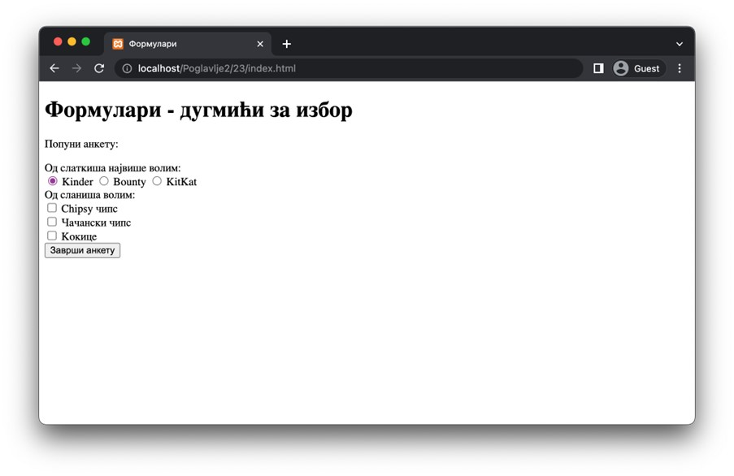
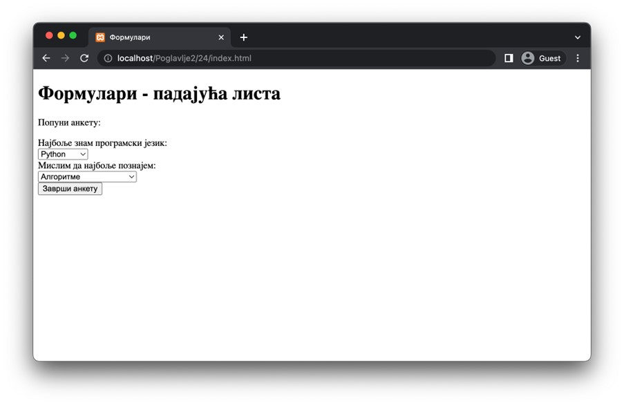
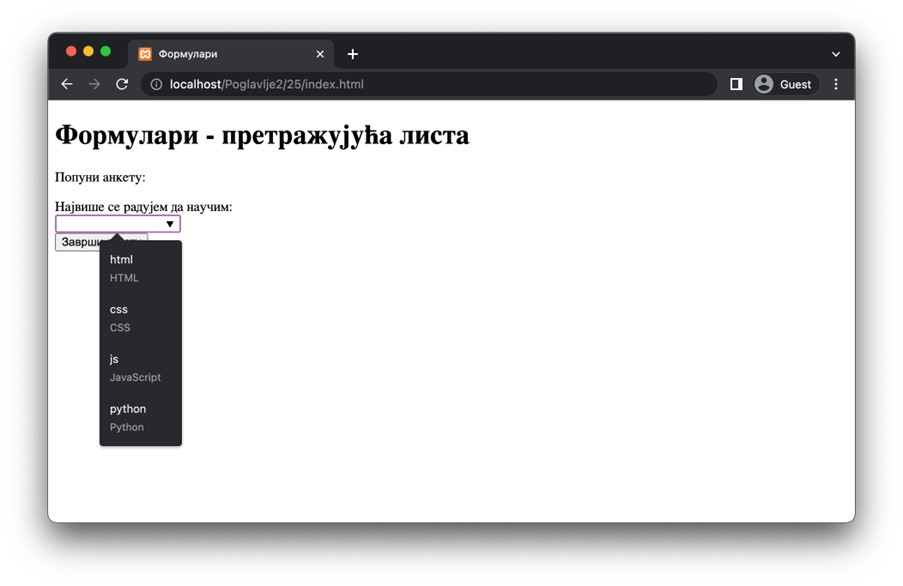
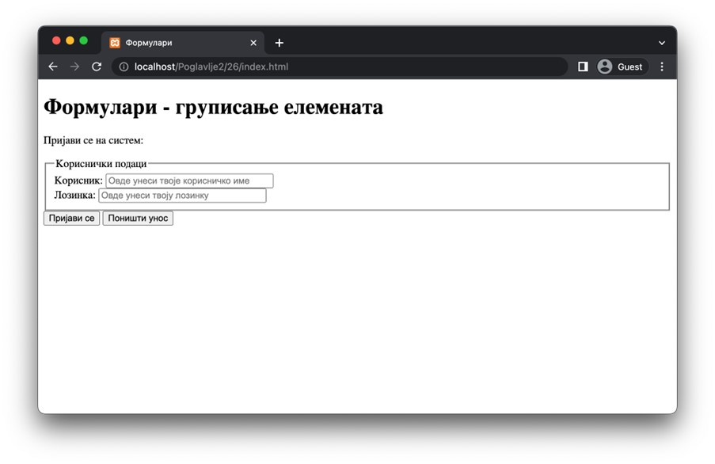

Поља за избор - груписање елемената
===================================

Подаци који имају мали број предефинисаних вредности могу се погодно приказати дугмићима за избор. Постоји два типа ових дугмића, а оба типа се представљају елементом *input*. Ова два типа дугмића су дефинисани наредним вредностима атрибута *type*:

- Вредност *radio* представља тзв. ексклузивно дугме (*radio button*), и употребљава се онда када корисник треба да одабере највише једну опцију. Подразумевано, у групи ових дугмића, уколико корисник промени избор, веб-прегледачи ће поништити претходни избор. Ово се омогућава тако што се ексклузивни дугмићи групишу према имену поља. Другим речима, сви ексклузивни дугмићи који имају исту вредност атрибута *name* припадају истој групи и само један од њих може бити означен. Атрибутом *value* се постављају вредности за свако дугме.
- Вредност *checkbox* представља тзв. неексклузивно дугме (*checkbox*), и користи се онда када корисник може да одабере произвољан број опција. Иако ови дугмићи могу имати исте вредности атрибута *name*, у већини случајева се препоручује да свако дугме има своју јединствену вредност на нивоу истог формулара.

Један користан Булов атрибут ових поља јесте *checked*, који ће бити присутан када корисник одабере одговарајуће дугме. Наравно, ти можеш у HTML коду поставити овај атрибут над било којим дугметом за избор да означиш која поља су подразумевано означена.

.. infonote::

    *Напомена*: Дугмићи за избор немају придружени текст, тако да је пожељно да свако дугме прати по један елемент label како би корисници разумели чему то дугме служи.

::

    Poglavlje2/23/index.html

Иако веома корисни, дугмићи за избор нису погодни у случају када кориснику треба омогућити избор између великог броја ставки. У том случају треба да тежиш ка употреби поља-листе. Два популарна елемента за креирање листи су елемент *select* и елемент *datalist*. Објаснимо како се користе. 

Елемент *select* представља тзв. падајућу листу, односно листу чије су ставке сакривене док корисник на њу не кликне, чиме се ставке приказују једна за другом испод поља (као да падају – отуда и назив листе). Свака ставка се представља једним елементом *option* и наводи се у садржају елемента *select*. Садржај елемента *option* представља текст који ће бити приказан у ставки листе. У сврху исправног подешавања падајуће листе, врло је важно да запамтиш наредне напомене:

- Атрибут *name* се наводи искључиво у оквиру елемента *select*.
- Атрибут *value* се наводи искључиво у оквиру елемента *option*.
- Текст који се наводи као садржај елемента *option* представља само визуелни садржај за корисника. Приликом подношења формулара једино се узима у обзир вредност атрибута *value* одабране ставке.

У случају заиста великог броја ставки, корисник може бити преплављен избором. Тада можеш да користиш елемент *optgroup*, који служи за груписање ставки под једним именом. Име се наводи као вредност атрибута *label* овог елемента. (Не дозволи да те збуни то што се назив овог атрибута поклапа са називом истоименог елемента који смо раније увели – у питању су две различите синтаксне одреднице језика HTML и нису ни на који начин повезани!)

::

    Poglavlje2/24/index.html

Други тип листе је тзв. претражујућа листа. Она је посебна по томе што се састоји од заједничке употребе два елемента (који нису у односу родитељ–дете као, на пример, елементи *select* и *option*). Дакле, да направиш претражујућу листу, треба да искористиш наредне елементе:

- Елемент *datalist* садржи ставке листе, које се представљају елементима *option*, слично као и код падајуће листе. Овом елементу је важно придружити идентификатор, који се користи у другом елементу.
- Други део листе јесте елемент *input* (уобичајено) типа *text*, који се повезује са претходно направљеном листом преко атрибута *list*, а чија је вредност идентификатор листе која садржи ставке.

Овако повезани елементи омогућавају да се, уношењем текста у једнолинијско текстуално поље, приказују само оне опције које садрже унети текст, што може бити веома корисно у случају великог броја ставки. Што се тиче напомена за подешавање претражујуће листе, оне су идентичне као код падајуће листе, са једном изменом:

- Атрибут *name* се наводи искључиво на нивоу једнолинијског текстуалног поља *input* за који је придружена листа.

::

    Poglavlje2/25/index.html

Користећи поља које сада знаш можеш правити најразличитије формуларе. Они формулари који се састоје од малог броја поља су углавном читљиви (уз адекватно постављене ознаке и друге визуалне елементе). Ипак, дужи формулари могу бити напорни за попуњавање. Један начин да корисницима олакшамо рад са формуларима јесте да групишемо сродна поља. У језику HTML ово је могуће постићи коришћењем блоковског елемента *fieldset*, који обележава једну групу поља. Овај елемент је често праћен елементом *legend* (који се наводи као његово прво дете), чији текстуални садржај служи да кориснику приближи о каквој групи података је реч.

::

    Poglavlje2/26/index.html

