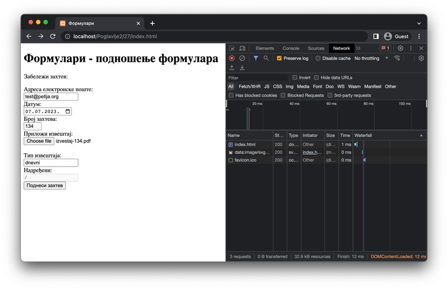
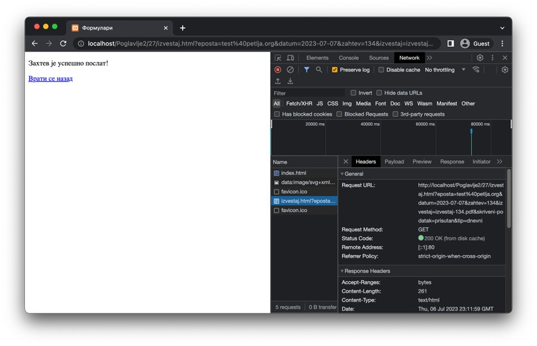
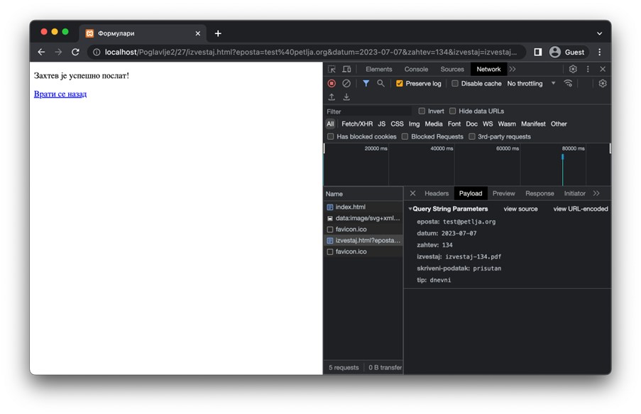
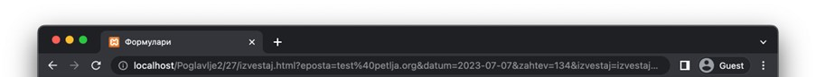
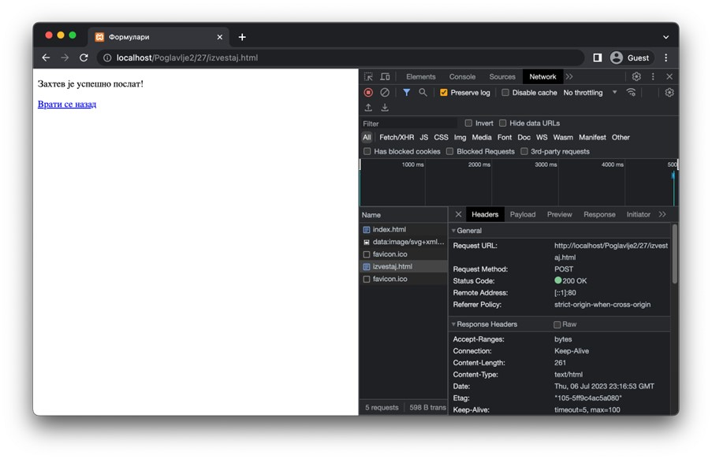
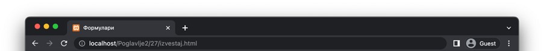

Подношење формулара
===================

Када корисник попуни формулар и притисне дугме за подношење, није свеједно где ће се унети подаци послати. Приликом развоја веб-апликација, а поготово веб-серверских апликација (о чему ће бити више речи у последњој теми), важно је добро испланирати ток података између веб-страница.

Обично, у оквиру веб-сајта постоји веб-страница на којој се налази формулар, а независно од ње постоји још једна веб-страница којој ће подаци бити послати на обраду. Када веб-прегледач пошаље захтев за другом веб-страницом, уз коју су послати и подаци које је корисник унео, веб-серверска апликација прво изврши обраду података. Обрада података се обично састоји од неколико корака. На самом крају, веб-серверска апликација уобичајено врати HTML документ са извештајем о успешности обраде или описом грешака до којих је дошло приликом обраде података. Понекад можеш да затекнеш да се, након подношења формулара, веб-прегледач упућује на исту страницу са које је захтев за подношењем формулара потекао (на пример, у случају да је очекивано да ће корисник неколико пута узастопно подносити исти формулар).

Како ти је за сада циљ да разумеш како функционише подношење формулара, у овој лекцији ће бити уведени основни концепти размене података које је важно да запамтиш јер ћеш их допуњавати у неким од наредних тема.

Почнимо од формулара који је дефинисан наредним HTML кодом. Прво ћемо појаснити значења неких нових типова једнолинијског текстуалног поља. Ови типови су описани у наставку:

- Тип *email* подразумева од корисника да унесе адресу електронске поште. У зависности од веб-прегледача, стриктност провере овог поља се може разликовати (а може и да не постоји), те се препоручује програмерима да имплементирају проверу у програмском коду.
- Тип *date* ће у већини савремених веб-прегледача понудити кориснику мали прозор са календаром за одабир датума. Након одабира датума, у зависности од веб-прегледача, датум може бити приказан на различите начине. На пример, за датум 5. јул 2023. године, један веб-прегледач може тај датум приказати као „05.07.2023.“, док ће неки други приказати „05/07/2023“. Ипак, ово је само визуална презентација. HTML стандард дефинише да вредност овог поља мора бити у формату „YYYY-MM-DD“, где је „YYYY“ ознака за одабрану годину, „MM“ ознака за одабран месец (са водећом нулом) и „DD“ ознака за одабран дан (са водећом нулом). 
- Тип *number* захтева од корисника да унесе текст који представља целобројну бројчану вредност. Овај тип поља се може додатно подесити атрибутима *min* и *max* којима се дефинише најмања и највећа дозвољена вредност, редом.
- Тип *file* се користи за прослеђивање докумената. Обично се представља дугметом које корисник треба да притисне како би отворио претраживач датотека оперативног система и, евентуално, текстуалном ознаком која садржи назив одабране датотеке. Датотеке ћемо посебно обрађивати када будемо обрађивали веб-серверске апликације, али за сада напоменимо да се оне посебно обрађују од осталих података (иако, као што ћеш ускоро видети, може да се стекне утисак да се веб-серверу прослеђује само назив датотеке).
- Тип *hidden* се користи када желимо да веб-серверу проследимо неке додатне податке без потребе да их корисник ручно уноси. Ово се често користи за контролне податке или сигурносне токене и служи за помоћ при обради података од стране веб-серверских апликација.

Једнолинијска текстуална поља имају и два корисна Булова атрибута – *readonly* и *disabled*. Њихова намена је слична – да се кориснику онемогући да мења садржај поља. Разлика између ова два атрибута је у томе што ће вредност поља које има постављен атрибут *readonly* бити послата веб-серверу приликом подношења формулара, док вредност поља које има постављен атрибут *disabled* неће.

Сада можеш погледати код прве веб-странице.

.. petlja-editor:: Poglavlje2/27/index.html

    index.html
    <!DOCTYPE html>
    <html lang="sr">
    <head>
        <meta charset="utf-8">
    </head>
    <title>Формулари</title>
    <body>
        <h1>Формулари - подношење формулара</h1>

        
Забележи захтев:

        <form action="./izvestaj.html" method="post">
        <label for="e-posta">Адреса електронске поште:</label>
         
        <input id="e-posta" name="eposta" type="email">
         

        <label for="odabrani-datum">Датум:</label>
         
        <input id="odabrani-datum" name="datum" type="date">
         

        <label for="broj-zahteva">Број захтева:</label>
         
        <input
            id="broj-zahteva"
            name="zahtev"
            type="number"
            min="100"
            max="999"
        >
         

        <label for="datoteka">Приложи извештај:</label>
         
        <input id="datoteka" name="izvestaj" type="file">
         

        <input type="hidden" name="skriveni-podatak" value="prisutan">
         

        <label for="tip-izvestaja">Тип извештаја:</label>
         
        <input
            id="tip-izvestaja"
            name="tip"
            type="text"
            value="dnevni"
            readonly
        >
         

        <label for="nadredjeni">Надређени:</label>
         
        <input id="naredjeni" name="nadredjeni" type="text" value="/" disabled>
         

        <input type="submit" value="Поднеси захтев">
        </form>
    </body>
    </html>

Поред појашњених атрибута на нивоу поља формулара, новина коју можеш приметити јесте да и сам формулар (тј. елемент *form*) има постављене вредности за два атрибута. Њихова значења су следећа:

- Атрибут *action* дефинише адресу веб-странице којој ће подаци бити прослеђени приликом подношења формулара. Ова адреса може бити релативна или апсолутна. Уколико се не наведе, подразумева се слање података на исту адресу (што си могао да видиш подношењем било којег од формулара из претходних примера).
- Атрибут *method* дефинише HTTP метод који ће бити коришћен за слање захтева за подношење формулара. Он може имати две вредности, GET и POST, које одговарају истоименим HTTP методима. 

.. learnmorenote:: **Занимљивост:**

    Да би формулар био успешно обрађен, важно је да се веб-сервер подеси тако да уме да прихвати захтев на датој адреси наведеним HTTP методом. Заправо, уобичајено је да веб-сервер објави списак приступних тачака (*endpoint*), тј. списак адреса и подржаних HTTP метода које су клијенти у обавези да поштују.

Важно је да научиш како из веб-прегледача да испратиш ток података између страница. У ту сврху ће ти помоћи језичак *Network* у оквиру алата за развој веб-прегледача. Потребно је да укључиш опцију *Preserve log* (за *Google Chrome* веб-прегледач; за остале веб-прегледаче можеш да пронађеш ову информацију у упутствима за њихову употребу). Разлог за укључивање ове опције јесте у томе што, подразумевано, веб-прегледачи чисте садржај језичака између HTTP захтева. Међутим, ми желимо да имамо увид у целу комуникацију између веб-прегледача и веб-сервера, што нам укључивање ове опције омогућава. Стање након попуњеног формулара, а пре његовог подношења, може да изгледа као на наредној слици.

Након што се формулар поднесе, можеш да приметиш (на наредној слици) неколико кључних ствари. Прва од њих је та да је веб-прегледач заиста послао нови HTTP захтев ка другој веб-страници, што се види у језичку *Headers* након што се одабере одговарајући HTTP захтев из списка. Такође, примети да је коришћен GET захтев.

Ако отвориш језичак *Payload* за исти захтев, приметићеш списак података који су послати на ову страницу. Овде је важно да приметиш да је наведено *Query String Parameters* као механизам преноса података. То значи да се, када се користи GET захтев за пренос података, подаци из формулара шаљу као део URL адресе (специфично, као параметри URL адресе). Ово је врло важна напомена јер има последице о којима треба да водиш рачуна. Ове последице су наведене у наредној табели.

+----------------------------------------------------------------------------------------------------------------------------------------+-------------------------------------------------------------------------------------------------------------------------------------------------------+
| Предности                                                                                                                              | Мане                                                                                                                                                  |
+========================================================================================================================================+=======================================================================================================================================================+
| Обрада параметара је једноставна за имплементацију.                                                                                    | URL адресе су ограничене, обично на 2048 карактера, што представља проблем у случају преноса великих или сложених података.                           |
+----------------------------------------------------------------------------------------------------------------------------------------+-------------------------------------------------------------------------------------------------------------------------------------------------------+
| Могуће је сачувати URL адресу заједно са подацима као обележивач (*bookmark*) на нивоу веб-прегледача за једноставан приступ и дељење. | Подаци су јасно видљиви у URL адреси, што значи да нису погодни за пренос осетљивих информација, као што су: лозинке, бројеви кредитних картица, итд. |
+----------------------------------------------------------------------------------------------------------------------------------------+-------------------------------------------------------------------------------------------------------------------------------------------------------+
| GЕТ захтеви могу бити кеширани од стране веб-прегледача, чиме се може убрзати њихова обрада.                                           |                                                                                                                                                       |
+----------------------------------------------------------------------------------------------------------------------------------------+-------------------------------------------------------------------------------------------------------------------------------------------------------+

Пример како изгледа URL адреса на коју се прослеђују подаци путем GET захтева:

::

    http://localhost/Poglavlje2/27/izvestaj.html?eposta=test%40petlja.org&datum=2023-07-07&zahtev=134&izvestaj=izvestaj-134.pdf&skriveni-podatak=prisutan&tip=dnevni

Ако промениш вредност атрибута *method* на вредност *post* у HTML документу прве странице и поново поднесеш формулар, приметићеш неке разлике. Прво, у језичку *Headers* можеш се уверити да је захтев заиста послат коришћењем метода POST.

.. learnmorenote:: Занимљивост:

    Веб-сервер XAMPP, који користиш за покретање примера је имплементиран тако да прихвата и POST методе за добављање HTML веб-страница. Ово понашање зависи од самог веб-сервера, тако да, уколико се одлучиш за неки други веб-сервер, можда ћеш у веб-прегледачу добити поруку да није могуће пронаћи тражену URL адресу. Приликом имплементације својих веб-серверских апликација, важно ће бити да подржимо исправне HTTP методе.

Отварањем језичка *Payload* приметићеш да подаци испрва делују идентично. Заиста, они то и јесу! Међутим, разликује се начин слања података – сада је наведено *Form Data* у веб-прегледачу. Ово је подразумевани начин за слање података приликом коришћења POST метода. Подаци су сада прослеђени кроз тело захтева у тзв. *application/x-www-form-urlencoded* формату који изгледа идентично као подаци из параметара URL адресе у случају GET захтева. У ово се можеш уверити кликом на опцију *View source*, чиме ћеш видети да је садржај тела POST захтева:

::

    eposta=test@petlja.org&datum=2023-07-07&zahtev=134&izvestaj=izvestaj-134.pdf&skriveni-podatak=prisutan&tip=dnevni

Такође, примети да URL адреса не садржи никакве параметре.

Осврнимо се и на неке особине коришћења POST захтева за пренос података из формулара.

+------------------------------------------------------------------------------------------------------------------------------------------------------------------------------------------------+------------------------------------------------------------------------------------------------------------------------------------------------+
| Предности                                                                                                                                                                                      | Мане                                                                                                                                           |
+================================================================================================================================================================================================+================================================================================================================================================+
| Тело захтева није видљиво у URL адреси захтева, чиме је безбедност нешто унапређена у односу на GET метод.                                                                                     |                                                                                                                                                |
+------------------------------------------------------------------------------------------------------------------------------------------------------------------------------------------------+------------------------------------------------------------------------------------------------------------------------------------------------+
| Тело POST захтева нема ограничење у виду величине садржаја, па је POST захтев погодан ако не можемо да претпоставимо количину података унапред или уколико очекујемо велику количину података. | Обрада података пренетих POST захтевом може захтевати додатно подешавање веб-сервера или веб-серверских апликација.                            |
+------------------------------------------------------------------------------------------------------------------------------------------------------------------------------------------------+------------------------------------------------------------------------------------------------------------------------------------------------+
| Видели смо да се за POST захтев подразумевано користи *urlencoded* формат података, али неки клијенти могу користити и друге формате, као што су XML или JSON.                                 | POST захтеви се уобичајено не кеширају од стране веб-прегледача, што може успорити рад веб-прегледача приликом обраде истих захтева више пута. |
+------------------------------------------------------------------------------------------------------------------------------------------------------------------------------------------------+------------------------------------------------------------------------------------------------------------------------------------------------+

.. infonote:: **Напомена:** 

    Иако су подаци померени из URL адресе у тело захтева у случају POST захтева, то не значи да је коришћење POST захтева довољно да бисмо осигурали безбедност преноса података кроз мрежу. Сетимо се да захтеви путују кроз велики број мрежних уређаја како би достигли одредишни мрежни уређај. На том путу, злонамерно треће лице може поставити ослушкиваче који умеју да отпакују поруке, чиме добијају сегменте HTTP захтева који се лако реконструишу на основу садржаја поруке. Због тога је неопходно да се ослонимо на HTTPS протокол, који користи SSL/TLS за шифровање података пре слања захтева. Дакле, још једном да утврдимо – избегавај да шаљеш своје приватне податке преко HTTP протокола!