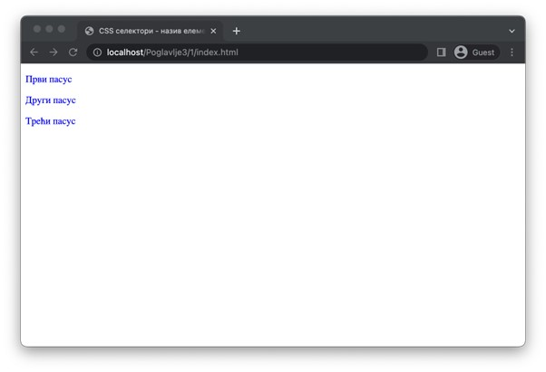
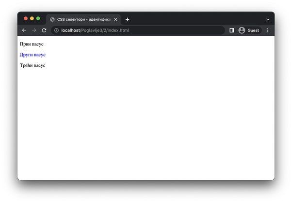
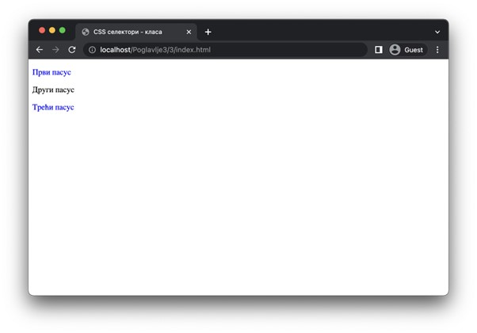
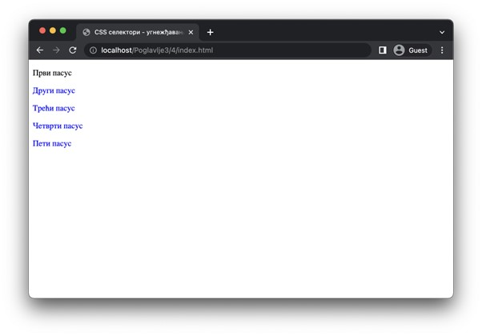
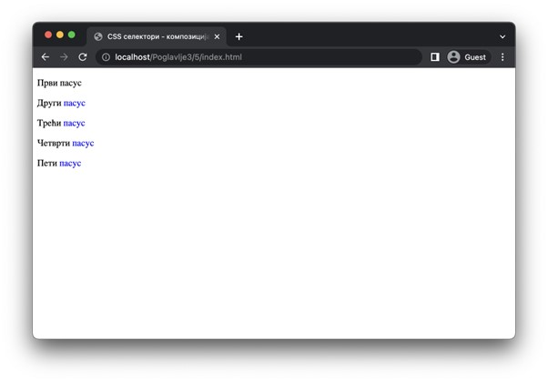
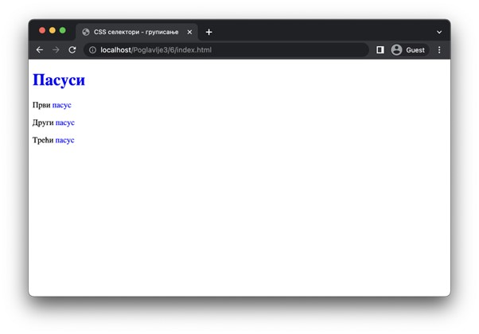
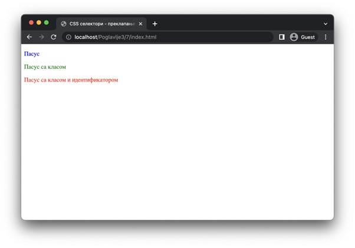
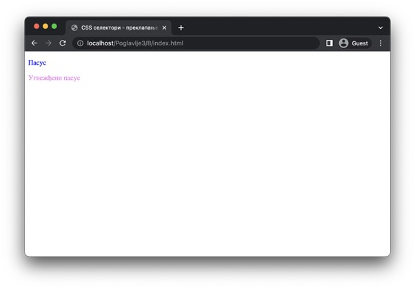
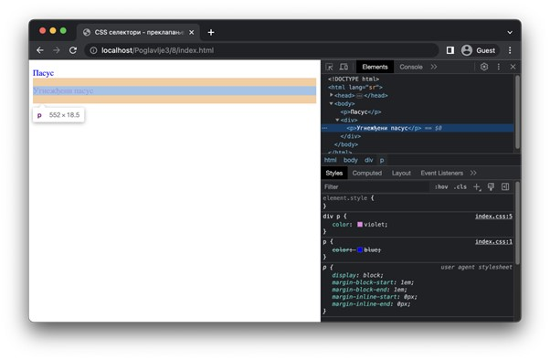

Селектори
=========

Као што смо рекли, селекторима одређујеш на које HTML елементе ће правило бити примењено. Постоји велики број селектора, а неки најосновнији су описани у наставку.

.. infonote::

    **Напомена:** У ”htdocs” директоријуму XAMPP инсталационог директоријума направи нови директоријум и назови га ”Poglavlje3”. Користи овај директоријум за смештање кодова из примера у овој теми. Такође, као и у случају са претходном темом, саветујемо да сваки пример наводиш у посебном директоријуму.

.. infonote::

    **Напомена:** У свим примерима из ове лекције користимо својство ”color” које одређује боју текстуалног садржаја како бисмо илустрирали понашање различитих врста селектора. Вредности овог својства ће бити неке од именованих боја, као што су: ”blue”, “red”, и сл. Већ у наредној лекцији ћеш научити нешто више о овом својству.

Први селектор који ћеш упознати јесте селектор за назив елемента. Навођењем само назива HTML елемента обухватићеш сва појављивања тог елемента у HTML документу. Назив елемента се наводи без знакова ”<” и ”>”, на пример, селектором ”p” ћеш обухватити све пасусе у документу.

.. petlja-editor:: Selektori

    index.html
    <!DOCTYPE html>
    <html lang="sr">
        <head>
            <meta charset="utf-8">
            <title>CSS селектори - назив елемента</title>

            <link rel="stylesheet" type="text/css" href="index.css">
        </head>
        <body>
            
Први пасус

            
Други пасус

            
Трећи пасус

        </body>
    </html>
    ~~~
    index.css
    p {
        color: blue;
    }

Да обухватиш један специфичан елемент из HTML садржаја, можеш да искористиш селектор за идентификатор. Овај селектор се наводи тако што наведеш карактер ”#” иза којег се наводи идентификатор елемента. На пример, ако желиш да обухватиш елемент ”

”, можеш да искористиш селектор ”#drugi-naslov”. Примети да не постоји размак између карактера ”#” и идентификатора и он ни не треба да постоји у овом случају (јер он представља потпуно други селектор, са којим ћеш се упознати ускоро).

.. petlja-editor:: Selektori2

    index.html
    <!DOCTYPE html>
    <html lang="sr">
        <head>
            <meta charset="utf-8">
            <title>CSS селектори - назив елемента</title>

            <link rel="stylesheet" type="text/css" href="index.css">
        </head>
        <body>
            
Први пасус

            
Други пасус

            
Трећи пасус

        </body>
    </html>
    ~~~
    index.css
    #drugi-naslov {
        color: blue;
    }

На сличан начин, све елементе који имају постављену исту класу можеш обухватити селектором за класу. Овај селектор се наводи тако што наведеш карактер ”.” иза којег се наводи назив класе. На пример, ако желиш да обухватиш све елементе који имају класу ”neparni-pasus”, можеш да искористиш селектор ”.neparni-pasus”. Примети да ни у овом случају не постоји размак између карактера ”.” и назива класе.

.. petlja-editor:: Selektori3
    
    index.html
    <!DOCTYPE html>
    <html lang="sr">
        <head>
            <meta charset="utf-8">
            <title>CSS селектори - класа</title>

            <link rel="stylesheet" type="text/css" href="index.css">
        </head>
        <body>
            
Први пасус

            
Други пасус

            
Трећи пасус

        </body>
    </html>
    ~~~
    index.css
    .neparni-pasus {
        color: blue;
    }

Наредни селектор се назива угнежђавање. Он се наводи карактером размака између било која два селектора. На пример, селектор ”div p” обухвата све елементе ”p” који се налазе у садржају елемената ”div” (тј. елементи ”p” који се не налазе у садржају неких елемената ”div” неће бити обухваћени овим селектором). Ово можеш да визуално запамтиш као да размак између селектора представља стрелицу ”🡪” која означава хијерархијску релацију између елемената обухваћених селекторима са леве и десне стране стрелице. Селектор из датог примера можеш прочитати као ”div🡪p”, тј. сви пасуси који су потомци свих елемената ”div”.

.. petlja-editor:: Selektori4

    index.html
    <!DOCTYPE html>
    <html lang="sr">
        <head>
            <meta charset="utf-8">
            <title>CSS селектори - угнежђавање</title>

            <link rel="stylesheet" type="text/css" href="index.css">
        </head>
        <body>
            
Први пасус

            

            
Други пасус

            
Трећи пасус

            

            

            
Четврти пасус

            
Пети пасус

            

        </body>
    </html>
    ~~~
    index.css
    div p {
        color: blue;
    }

Селекторе је могуће комбиновати и тако настају селектори композиције. На пример, селектором ”div p span.kljucna-rec” (или, ако замислимо другачије, ”div🡪p🡪span.kljucna-rec”) обухваћени су сви елементи ”span” који имају класу ”kljucna-rec” и који се налазе као део садржаја елемената ”p” који се, заузврат, налазе као део садржаја елемената ”div”. Као што видиш, композицијом се могу дефинисати веома интересантни селектори који обухватају елементе на врло специфичне начине.

.. petlja-editor:: Selektori5

    index.html
    <!DOCTYPE html>
    <html lang="sr">
        <head>
            <meta charset="utf-8">
            <title>CSS селектори - композиција</title>

            <link rel="stylesheet" type="text/css" href="index.css">
        </head>
        <body>
            
Први пасус

            

            
Други пасус

            
Трећи пасус

            

            

            
Четврти пасус

            
Пети пасус

            

        </body>
    </html>
    ~~~
    index.css
    div p span.kljucna-rec {
        color: blue;
    }

Последњи селектор који ћемо приказати је унија. Он се наводи коришћењем карактера ”,” између два селектора. Декларације које су наведене у CSS правилу са селектором уније ће бити примењене на све елементе који су обухваћени првим селектором, али такође и на све елементе који су обухваћени другим селектором. На пример, селектором уније ”h1,span” биће обухваћени сви елементи ”h1”, али и сви елементи ”span”. Очигледна примена селектора уније јесте у смањивању броја идентичних правила – уместо да наведемо два правила која се разликују само по селекторима, можемо декларације из та два правила спојити у једно и извршити унију њихових селектора.

.. petlja-editor:: Selektori6

    index.html
    <!DOCTYPE html>
    <html lang="sr">
        <head>
            <meta charset="utf-8">
            <title>CSS селектори - груписање</title>

            <link rel="stylesheet" type="text/css" href="index.css">
        </head>
        <body>
            <h1>Пасуси</h1>
            
Први пасус

            
Други пасус

            
Трећи пасус

        </body>
    </html>
    ~~~
    index.css
    h1, span {
        color: blue;
    }

Ово су само неки од најзначајнијих селектора. Постоји велики број других селектора, а потпун списак се може пронаћи на адреси https://www.w3schools.com/cssref/css_selectors.php. 

Преклапање стилова
__________________

Примена различитих правила може довести до преклапања стилова. Наиме, селектори у различитим правилима могу обухватити исте елементе у оквиру веб-странице. На пример, ако постоје два правила чији су селектори ”div” и ”.obavestenje”, редом, онда ће елемент ”

” бити обухваћен обама правилима. Поставља се питање шта ће се десити ако оба правила садрже декларацију која има исто својство.

Одговор на ово питање лежи у приоритету селектора. Ова правила су добро дефинисана у језику CSS и има их много. Ова правила можемо (веома угрубо и непрецизно) описати на следећи начин: селектори који имају шири ”опсег” имају мањи приоритет од селектора који имају ужи ”опсег”. Другим речима, што је неки селектор ”специфичнији”, то је већа шанса да ће бити примењен.

Тако, на пример, селектори на основу назива елемента имају мањи приоритет од селектора класа, који имају мањи приоритет од селектора идентификатора. Наредни пример илуструје ове приоритете.

.. petlja-editor:: Selektori7

    index.html
    <!DOCTYPE html>
    <html lang="sr">
        <head>
            <meta charset="utf-8">
            <title>CSS селектори - преклапање стилова</title>

            <link rel="stylesheet" type="text/css" href="index.css">
        </head>
        <body>
            
Пасус

            
Пасус са класом

            
Пасус са класом и идентификатором

        </body>
    </html>
    ~~~
    index.css
    p {
        color: blue;
    }

    .tekst {
        color: green;
    }

    #pasus {
        color: red;
    }

Такође, угнежђени селектори на основу назива елемента имају већи приоритет од истих селектора који нису угнежђени (али и даље су мањег су приоритета од селектора класе и идентификатора, с обзиром да се ипак ослањају на називе елемената за обухватање). Наредни пример илуструје ово понашање.

.. petlja-editor:: Selektori8

    index.html
    <!DOCTYPE html>
    <html lang="sr">
        <head>
            <meta charset="utf-8">
            <title>CSS селектори - преклапање стилова</title>

            <link rel="stylesheet" type="text/css" href="index.css">
        </head>
        <body>
            
Пасус

            

            
Угнежђени пасус

            

        </body>
    </html>
    ~~~
    index.css
    p {
        color: blue;
    }

    div p {
        color: violet;
    }

И различити начини задавања CSS правила, па чак и редослед увезивања може променити ово понашање. Детаљан опис ових правила превазилази оквире овог курса. Ипак, најбољи начин да провериш редослед примене неких правила јесте да осматраш језичак ”Elements” у алатима за развој у оквиру веб-прегледача. Ако означиш неки елемент, у језичку ”Styles” можеш да видиш сва CSS правила која су примењена на тај елемент, уређена од оних са највећим приоритетом до оних са најнижим приоритетом (што је увек подразумевано стилизовање веб-прегледача). Ако погледаш стилове, на пример, угнежђени пасус из претходног примера, уверићеш се да су заиста оба правила из CSS датотеке примењена на тај пасус. Ипак, правило које је ”ужег” опсега (у овом случају, то је правило са угнежђеним селектором) изабрано је за правило које ће бити примењено због већег приоритета. Декларације са истом својством из свих правила нижег приоритета ће бити прецртана.

.. learnmorenote:: **Занимљивост:**

    Чињеница да се различита правила и одговарајући стилови слажу једна на друге одаје утисак каскадног принципа примене, по чему је и овај језик добио своје име.